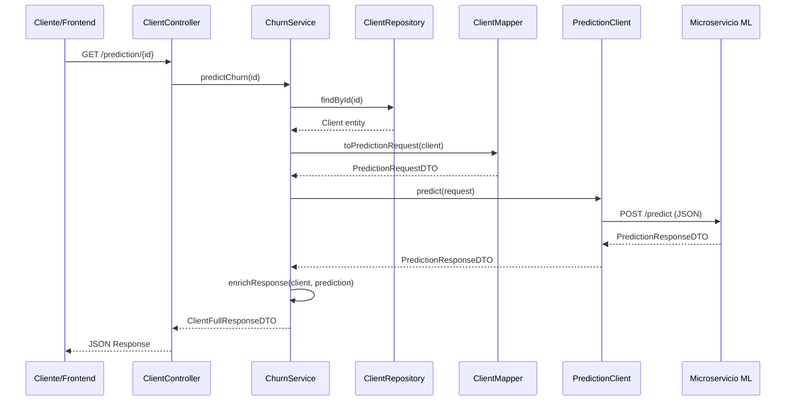

# Integración con Modelo ML - ChurnCheck

## Objetivo

Definir la arquitectura específica para consumir el modelo de Machine Learning a través de un RestClient, siguiendo las mejores prácticas de Spring Boot y manteniendo la separación de responsabilidades.

## Arquitectura Propuesta

### 1. **Capa de Infraestructura (Client Externo)**

#### Componentes

- **`PredictionClient`**: Interfaz RestClient para comunicarse con el microservicio ML
- **`PredictionRequestDTO`**: DTO que representa la solicitud al modelo ML
- **`PredictionResponseDTO`**: DTO que representa la respuesta del modelo ML
- **`PredictionErrorHandler`**: Manejo específico de errores de la API externa

#### Tecnologías

- **Spring WebFlux WebClient**: Para llamadas HTTP asíncronas y no bloqueantes
- **Jackson**: Para serialización/deserialización JSON (opcionalmente Gson)
- **Resilience4j**: Para circuit breaker y retries (Sprints futuros)

### 2. **Capa de Servicio (Business Logic)**

#### Componentes

- **`ChurnService`**: Orquestador principal de la lógica de predicción
- **`ClientMapper`**: Transformación entre entidades y DTOs del modelo ML
- **`PredictionCacheService`**: Caché de predicciones (Sprints futuros)

#### Responsabilidades

- Buscar cliente por ID en la base de datos
- Mapear datos del cliente al formato esperado por el modelo
- Llamar al cliente externo y manejar errores
- Procesar respuesta y enriquecer con datos del cliente

### 3. **Capa de API (Controller)**

#### Componentes

- **`ClientController`**: Endpoint expuesto para predicciones
- **`PredictionController`**: Endpoint dedicado para predicciones directas
- **Validaciones**: Input validation con Jakarta Validation

## Estructura de Directorios Detallada

```yaml
backend/
├───src/
│   ├───main/
│   │   ├───java/
│   │   │   └───com/
│   │   │       └───churncheck/
│   │   │           └───api/
│   │   │               ├───controller/
│   │   │               │   ├─── ClientController.java          [EXISTENTE + devC]
│   │   │               │   │   ├─── GET /clients              [EXISTENTE]
│   │   │               │   │   ├─── POST /clients             [EXISTENTE]
│   │   │               │   │   ├─── PUT /clients              [EXISTENTE]
│   │   │               │   │   ├─── DELETE /clients/{id}      [EXISTENTE]
│   │   │               │   │   └─── GET /prediction/{id}     [NUEVO - devC]
│   │   │               │   └─── PredictionController.java     [NUEVO - Opcional]
│   │   │               │       └─── POST /predict             [NUEVO - Directo]
│   │   │               │                                       
│   │   │               ├───domain/
│   │   │               │   ├───client/
│   │   │               │   │   ├─── Client.java                [EXISTENTE]
│   │   │               │   │   ├─── ClientRepository.java      [EXISTENTE + devC]
│   │   │               │   │   │   └─── findById(Long id)  [NUEVO - devC]
│   │   │               │   │   ├─── PredictionResponseDTO.java    [NUEVO - devB]
│   │   │               │   │   ├─── ClientFullResponseDTO.java     [NUEVO - devB]
│   │   │               │   │   ├─── ClientCreateRequestDTO.java    [EXISTENTE]
│   │   │               │   │   ├─── ClientUpdateRequestDTO.java    [EXISTENTE]
│   │   │               │   │   ├─── ClientResponseDTO.java       [EXISTENTE]
│   │   │               │   │   └─── ClientListResponseDTO.java     [EXISTENTE]
│   │   │               │   │   ├─── Gender.java               [EXISTENTE]
│   │   │               │   │   └─── ClientMapper.java     [NUEVO - devB]
│   │   │               │   │                                       
│   │   │               │   └───user/
│   │   │               │       ├─── User.java                 [EXISTENTE]
│   │   │               │       ├─── UserRepository.java        [EXISTENTE]
│   │   │               │       ├─── Role.java                 [EXISTENTE]
│   │   │               │       ├─── UserResponseDTO.java   [EXISTENTE]
│   │   │               │       └─── LoginRequestDTO.java   [EXISTENTE]
│   │   │               │                                       
│   │   │               ├───service/                            [NUEVA CAPA - devB]
│   │   │               │   ├─── ChurnService.java              [NUEVO - devB]
│   │   │               │   ├─── cache/                         [NUEVA CARPETA - Opcional Sprints futuros]
│   │   │               │   │   └─── PredictionCacheService.java [NUEVO - Opcional Sprints futuros]
│   │   │               │   └─── exception/                     [NUEVA CARPETA - devB]
│   │   │               │       ├─── PredictionException.java  [NUEVO - devB]
│   │   │               │       └─── ClientNotFoundException.java [NUEVO - devB]
│   │   │               │                                       
│   │   │               └───infra/
│   │   │                   ├───clients/                         [NUEVA CAPA - devA]
│   │   │                   │   ├─── PredictionClient.java      [NUEVO - devA]
│   │   │                   │   ├─── WebClientConfig.java   [NUEVO - devA]
│   │   │                   │   ├─── PredictionRequestDTO.java    [NUEVO - devA]
│   │   │                   │   ├─── PredictionResponseDTO.java    [NUEVO - devA]
│   │   │                   │   └─── ErrorResponseDTO.java         [NUEVO - devA]
│   │   │                   │                                       
│   │   │                   ├───security/                         [EXISTENTE]
│   │   │                   │   ├─── SecurityConfig.java         [EXISTENTE]
│   │   │                   │   ├─── SecurityFilter.java         [EXISTENTE]
│   │   │                   │   ├─── TokenService.java           [EXISTENTE]
│   │   │                   │   ├─── AuthUserService.java        [EXISTENTE]
│   │   │                   │   ├─── AuthUser.java               [EXISTENTE]
│   │   │                   │   ├─── LoginRequestDTO.java         [EXISTENTE]
│   │   │                   │   └─── TokenDTO.java               [EXISTENTE]
│   │   │                   │                                       
│   │   │                   └───springdoc/                       [EXISTENTE]
│   │   │                       └─── SpringDocConfig.java        [EXISTENTE]
│   │   │                                       
│   │   └───resources/
│   │       ├─── application.yaml                               [EXISTENTE + devA]
│   │       │   ├─── server:                                    [EXISTENTE]
│   │       │   ├─── spring:                                    [EXISTENTE]
│   │       │   └─── ml:                                        [NUEVA SECCIÓN - devA]
│   │       │       ├─── service:                               [NUEVO]
│   │       │       │   ├─── url: http://localhost:8000         [NUEVO]
│   │       │       │   ├─── timeout: 5000ms                    [NUEVO]
│   │       │       │   └─── retries: 3                        [NUEVO]
│   │       │       └─── endpoints:                             [NUEVO]
│   │       │           └─── predict: /predict                  [NUEVO]
│   │       │                                       
│   │       └─── application-test.yaml                          [NUEVO - Testing]
│   │           └─── ml:                                        [NUEVO]
│   │               └─── service:                               [NUEVO]
│   │                   └─── url: http://localhost:8081/mock-ml [NUEVO]
│   │                                       
│   └───test/
│                                       
├───docs/
|                                       
├───pom.xml                                      [EXISTENTE + devA]
│   ├─── spring-boot-starter-webflux           [NUEVA DEPENDENCIA - devA]
│   ├─── resilience4j-spring-boot2             [NUEVA DEPENDENCIA - Sprints futuros]
│   └─── spring-boot-starter-cache             [NUEVA DEPENDENCIA - Sprints futuros]
│                                       
└───mvnw/                                       [EXISTENTE]
```

## Flujo de Datos Detallado



## Estrategia

### **Opción A: Extender Entidad Client (Recomendado)**

- **Pros:** Mapeo directo, sin transformaciones complejas
- **Contras:** Modificar entidad existente
- **Implementación:** Agregar campos faltantes a `Client.java`

### **Opción B: DTO Intermedio (Alternativa)**

- **Pros:** No modificar entidad existente
- **Contras:** Requiere lógica de mapeo compleja
- **Implementación:** Crear `ClientMLDataDTO` con todos los campos del modelo

## Implementación Técnica

### 1. **Configuración de WebClient**

```yaml
# application.yaml
ml:
  service:
    url: http://localhost:8000
    timeout: 5000
    retries: 3
  endpoints:
    predict: /predict
```

### 2. **DTOs del Modelo ML**

#### PredictionRequestDTO

```java
public record PredictionRequestDTO(
    Integer age,
    String gender,
    Integer nearLocation,
    Integer partnerEmployee,
    Integer promoFriends,
    Integer contractPeriod,
    Integer monthToEndContract,
    Integer lifetimeMonths,
    Double avgClassFrequencyTotal,
    Double avgClassFrequencyCurrentMonth
) {}
```

**⚠️ Nota Importante:**
Actualmente la entidad `Client` solo tiene los campos básicos (`id`, `clientName`, `clientEmail`, `gender`, `clientPhone`, `nearLocation`, `age`). Para usar los campos adicionales del dataset del modelo ML (`partnerEmployee`, `promoFriends`, `contractPeriod`, etc.), se debe extender la entidad `Client` con estos campos o crear un DTO de mapeo intermedio.

#### PredictionResponseDTO

```java
public record PredictionResponseDTO(
    String prediction,           // "Will churn" / "Will continue"
    Double probability,        // 0.0 - 1.0
    LocalDateTime timestamp,    // Timestamp of the prediction
    String modelVersion        // Version of the model used
) {}
```

### 3. **ClientFullResponseDTO (Respuesta Final)**

```java
public record ClientFullResponseDTO(
    // Client data
    Long id,
    String clientName,
    String clientEmail,
    
    // Prediction data
    String prediction,
    Double probability,
    LocalDateTime predictionTimestamp,
    
    // Metadata
    String modelVersion,
    Long processingTimeMs
) {}
```

## Estrategias de Manejo de Errores

### 1. **Manejo Básico de Errores HTTP**

- Capturar 404, 500, 503 del servicio ML
- Proporcionar mensajes de error significativos
- Logging de errores de conexión

### 2. **Timeout Simple**

- Configurar timeout de 5 segundos
- Manejo de connection timeout
- Evitar bloqueos indefinidos

### 3. **Validaciones Esenciales**

- Validar ID del cliente antes de búsqueda
- Validar datos mínimos requeridos
- Manejo básico de errores HTTP

## Consideraciones de Performance

### 1. **Timeout Básico**

- Configurar timeout de 5 segundos en WebClient
- Evitar llamadas bloqueantes prolongadas
- Manejo básico de timeouts

### 2. **Logging Simple**

- Log de requests/responses del ML service
- Métricas básicas de latencia
- Registro de errores de conexión

### 3. **Validaciones Esenciales**

- Validar ID del cliente antes de búsqueda
- Validar datos mínimos requeridos
- Manejo básico de errores HTTP

## Seguridad

### 1. **Autenticación Básica**

- API Key para comunicarse con microservicio ML
- Headers básicos en llamadas HTTP
- Log simple de predicciones

### 2. **Datos Sensibles**

- No enviar datos personales en logs
- Validar datos mínimos antes de enviar
- Cumplimiento básico de privacidad

## Plan de Ejecución (MVP Básico)

### **Fase 1: Infraestructura Básica (devA)**

#### **Tarea 1.1: Configurar WebClient**

- **Archivo:** `WebClientConfig.java`
- **Acción:** Crear bean WebClient con headers básicos
- **Entregable:** WebClient funcional

#### **Tarea 1.2: Crear DTOs ML**

- **Archivos:**
  - `PredictionRequestDTO.java`
  - `PredictionResponseDTO.java`
- **Acción:** Records con campos del dataset ML
- **Entregable:** DTOs listos

#### **Tarea 1.3: Implementar PredictionClient**

- **Archivo:** `PredictionClient.java`
- **Acción:** Método predict() con llamada HTTP POST
- **Entregable:** Cliente conectado al mock

#### **Tarea 1.4: Configurar application.yaml**

- **Archivo:** `application.yaml`
- **Acción:** URL del mock de Postman
- **Entregable:** Configuración funcionando

---

### **Fase 2: Lógica de Negocio (devB)**

#### **Tarea 2.1: Crear ChurnService**

- **Archivo:** `ChurnService.java`
- **Acción:** Método predictChurn(Long id) orquestador
- **Entregable:** Servicio básico

#### **Tarea 2.2: Implementar ClientMapper**

- **Archivo:** `ClientMapper.java`
- **Acción:** toPredictionRequest() con campos disponibles
- **Entregable:** Mapper funcional

#### **Tarea 2.3: DTOs de Respuesta**

- **Archivos:**
  - `PredictionResponseDTO.java`
  - `ClientFullResponseDTO.java`
- **Acción:** DTOs para respuesta final
- **Entregable:** Respuestas estructuradas

---

### **Fase 3: API Endpoints (devC)**

#### **Tarea 3.1: Verificar ClientRepository**

- **Archivo:** `ClientRepository.java`
- **Acción:** Confirmar que findById() existe
- **Entregable:** Repository listo

#### **Tarea 3.2: Crear Endpoint**

- **Archivo:** `ClientController.java`
- **Acción:** GET /prediction/{id} con inyección de ChurnService
- **Entregable:** Endpoint funcional

#### **Tarea 3.3: Validaciones Básicas**

- **Archivo:** `ClientController.java`
- **Acción:** Manejo 404 para cliente no encontrado
- **Entregable:** Manejo de errores básico

---

## **Scope del Sprint 2 - MVP**

### **✅ Incluido:**

- WebClient básico con mock de Postman
- DTOs de comunicación ML
- ChurnService orquestador simple
- ClientMapper con campos disponibles
- Endpoint GET /prediction/{id}
- Manejo básico de errores

### **❌ No incluido (Sprints futuros):**

- Circuit Breaker y resiliencia avanzada
- Caching y optimización de performance
- Métricas y monitoring complejo
- Tests de integración automatizados
- Validaciones avanzadas
- Documentación OpenAPI completa

## **Campos del Mapper**

```java
public static PredictionRequestDTO toPredictionRequest(Client client) {
    return new PredictionRequestDTO(
        client.getAge(),                    // ✅ Disponible
        client.getGender().toString(),      // ✅ Disponible  
        client.getNearLocation(),           // ✅ Disponible
        null, // partnerEmployee           // ❌ No disponible aún
        null, // promoFriends               // ❌ No disponible aún
        null, // contractPeriod             // ❌ No disponible aún
        null, // monthToEndContract         // ❌ No disponible aún
        null, // lifetimeMonths             // ❌ No disponible aún
        null, // avgClassFrequencyTotal     // ❌ No disponible aún
        null  // avgClassFrequencyCurrentMonth // ❌ No disponible aún
    );
}
```

**Nota:** Para el MVP, los campos no disponibles se envían como `null` y el mock debe manejar estos casos.

## **Flujo Simplificado:**

```yml
GET /prediction/{id} 
→ ClientController 
→ ChurnService 
→ ClientRepository.findById(id) 
→ ClientMapper.toPredictionRequest() 
→ PredictionClient.predict() 
→ Mock Postman 
→ ClientFullResponseDTO
```

## Testing Strategy (Sprints futuros)

### 1. **Unit Tests**

- Mock del PredictionClient
- Test de mapeo de datos
- Test de lógica de negocio

### 2. **Integration Tests**

- Test con WireMock para simular ML service
- Test end-to-end del flujo completo
- Test de manejo de errores

### 3. **Performance Tests**

- Load testing del endpoint
- Test de timeout y retries
- Test de concurrencia

## Referencias y Best Practices

- **Spring WebClient**: Guía oficial de reactive web client
- **Resilience4j**: Patterns de resiliencia para microservicios
- **Circuit Breaker Pattern**: Martin Fowler's pattern
- **REST API Design**: Best practices de Richardson Maturity Model
