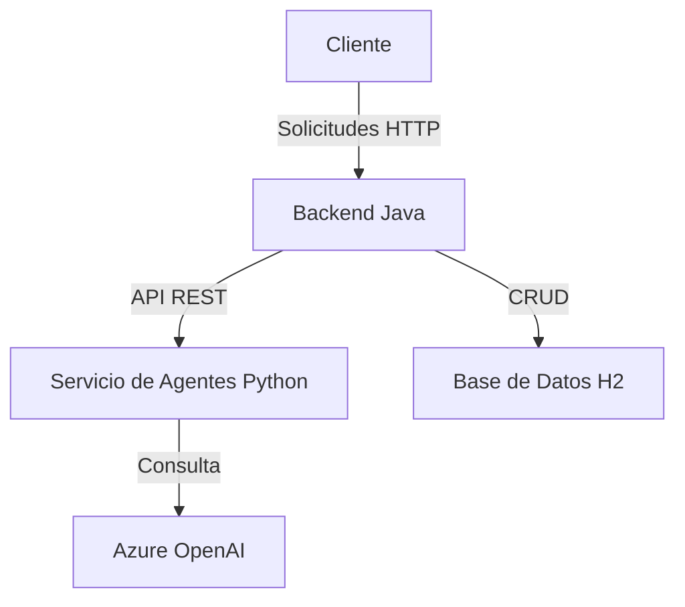
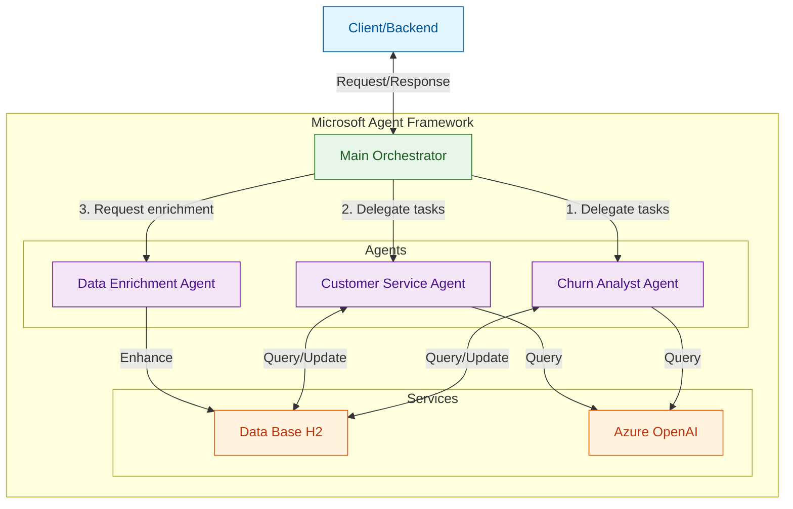
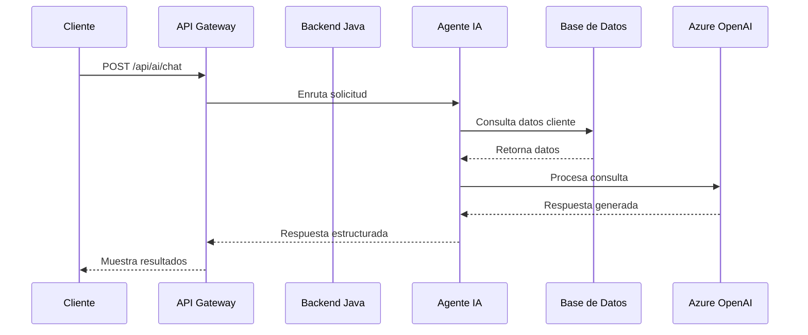

# Arquitectura para Agentes de IA Generativa

## Visión General



**Nota**: Arquitectura simplificada para desarrollo inicial, sin componentes de escalabilidad avanzada.

## 1. Componentes Principales

### 1.1 Capa de Presentación

- **API REST** (Java Spring Boot)
  - Endpoint: `POST /api/ai/chat`
  - Autenticación: API Key
  - Formato: JSON

### 1.2 Servicio de Agentes (Python)

- **Framework**: Agent Framework MAF, FastAPI
- **Patrón**: Agent-based architecture

### 1.3 Base de Conocimiento

- **Almacenamiento**: Base de datos H2
- **Datos**:
  - Historial de interacciones
  - Perfiles de clientes

## 2. Agentes Propuestos

### 2.1 Churn Analyst Agent

- **Responsabilidad**: Analizar riesgo de churn
- **Entradas**: Datos de cliente, historial
- **Salidas**: Análisis predictivo, recomendaciones

### 2.2 Customer Service Agent

- **Responsabilidad**: Asistencia al cliente
- **Capacidades**:
  - Respuestas a preguntas frecuentes
  - Guía de solución de problemas
  - Escalamiento a agente humano

### 2.3 Data Enrichment Agent (poco relevante)

- **Responsabilidad**: Mejorar datos de entrada
- **Funciones**:
  - Enriquecimiento con fuentes externas
  - Normalización de datos
  - Validación de calidad

## 3. Orquestación de Agentes

### 3.1 Arquitectura de Orquestación



### 3.2 Flujo de Trabajo

1. **Recepción de Solicitud**:
   - El orquestador recibe una solicitud del backend Java
   - Valida y parsea la solicitud

2. **Enrutamiento Inteligente**:
   - Determina qué agente(s) deben manejar la solicitud
   - Puede dividir tareas complejas en subtareas

3. **Ejecución Paralela**:
   - Los agentes trabajan de forma concurrente cuando es posible
   - El orquestador maneja las dependencias entre tareas

4. **Consolidación de Resultados**:
   - Agrega y formatea las respuestas
   - Aplica reglas de negocio adicionales
   - Devuelve una respuesta unificada

### 3.3 Ventajas de MAF

- **Gestión de Estado**: Mantiene el contexto entre llamadas
- **Patrones de Reintento**: Manejo automático de fallos
- **Observabilidad**: Monitoreo integrado de agentes
- **Extensibilidad**: Fácil adición de nuevos agentes

## 4. Flujo de Datos



## 4. Estructura del Repositorio

```yml
nc-oneiila-e14b/
├── backend-java/           # Backend principal (Spring Boot)
│   ├── src/
│   │   ├── main/
│   │   │   ├── java/com/churninsight/
│   │   │   │   ├── config/        # Configuraciones
│   │   │   │   ├── controller/    # Controladores REST
│   │   │   │   ├── service/       # Lógica de negocio
│   │   │   │   ├── repository/    # Acceso a datos
│   │   │   │   └── model/         # Entidades y DTOs
│   │   │   └── resources/
│   │   └── test/                  # Pruebas Java
│   └── pom.xml
│
├── ai-agents/              # Servicio de Agentes IA (Python)
│   ├── app/
│   │   ├── __init__.py
│   │   ├── main.py               # Punto de entrada FastAPI
│   │   ├── config.py             # Configuraciones
│   │   ├── agents/               # Implementación de agentes
│   │   │   ├── __init__.py
│   │   │   ├── base_agent.py
│   │   │   ├── churn_analyst.py
│   │   │   └── service_agent.py
│   │   ├── api/                 # Endpoints de la API
│   │   └── models/              # Modelos Pydantic
│   ├── requirements.txt
│   └── tests/                   # Pruebas Python
│
└── doc/                      # Documentación
```

## 5. Requisitos Técnicos

### 5.1 Infraestructura

- Python 3.12+
- Microsoft Agent Framework (MAF)
- FastAPI
- Azure OpenAI Service
- Base de datos H2

### 5.2 Seguridad

- Autenticación por API Key
- Cifrado en tránsito (HTTPS)
- Validación de entrada/salida

## 6. Recursos Adicionales

- [Documentación Azure Foundry](https://learn.microsoft.com/en-us/azure/ai-foundry/what-is-azure-ai-foundry?view=foundry-classic)
- [Documentación Microsoft Agent Framework](https://learn.microsoft.com/en-us/agent-framework/overview/agent-framework-overview)
- [Guía FastAPI](https://fastapi.tiangolo.com/)
- [Patrones de diseño para IA](https://docs.microsoft.com/en-us/azure/architecture/patterns/)
