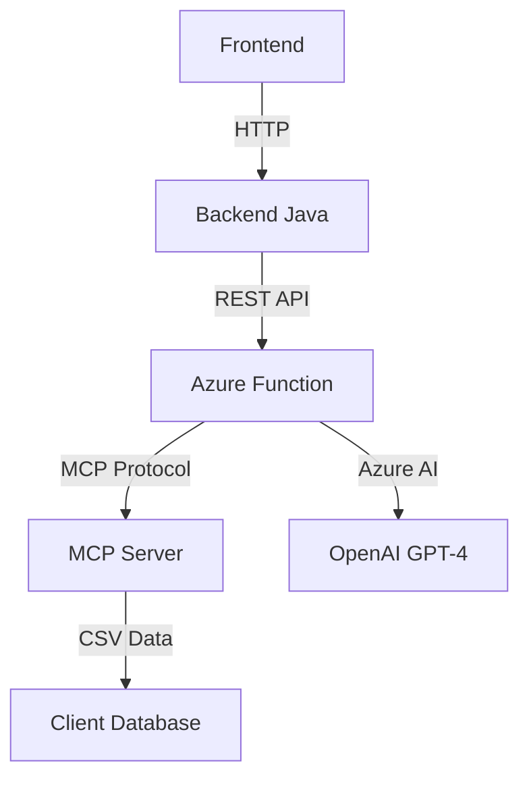

# Arquitectura para Agentes de IA Generativa - ChurnCheck

## Visión General

Arquitectura de microservicios para análisis de churn con agentes IA especializados y acceso dinámico a datos.



## 1. Componentes Principales

### 1.1 Frontend

- Interfaz de usuario para análisis de clientes
- Visualización de métricas de churn

### 1.2 Backend Java (Spring Boot)

- API REST principal
- Endpoint: `POST /api/chat`
- Autenticación y validación
- Enrutamiento a Azure Function

### 1.3 Azure Function (Python)

- Microservicio serverless
- Agent Framework con Azure AI
- Integración MCP Server
- Endpoints: `/api/chat`, `/api/health`

### 1.4 MCP Server

- Model Context Protocol
- Acceso dinámico a datos CSV
- Herramientas: `get_client_by_id`, `analyze_churn_risk`, `list_clients`

### 1.5 Base de Datos

- CSV con 15 clientes
- Datos: DNI, nombre, contrato, ubicación, actividad
- Actualizable sin re-deploy

## 2. Agentes Implementados

### 2.1 Churn Analysis Agent

- **Función**: Análisis de riesgo de churn
- **Entradas**: ID de cliente (DNI-XXXX)
- **Salidas**: Nivel de riesgo (BAJO/MEDIO/ALTO), recomendaciones
- **Algoritmo**: Basado en antigüedad, contrato, ubicación, actividad

### 2.2 General Assistant Agent

- **Función**: Asistente conversacional
- **Capacidades**: Preguntas generales sobre churn, patrones, factores
- **Respuestas**: Análisis cualitativo sin datos específicos

## 3. Flujo de Arquitectura

### 3.1 Flujo de Datos Principal

1. **Frontend** solicita análisis de cliente
2. **Backend Java** valida y enruta a Azure Function
3. **Azure Function** invoca agente con herramientas MCP
4. **MCP Server** lee datos del CSV
5. **Agente** procesa con Azure AI y retorna análisis
6. **Respuesta** viaja de vuelta al frontend

### 3.2 Cálculo de Riesgo

- Antigüedad: < 6 meses (35% peso)
- Contrato: mensual (30% peso)
- Ubicación: lejana (15% peso)
- Visitas grupales: no participa (10% peso)
- Partner: sin asignar (5% peso)
- Promoción amigos: sin referidos (5% peso)

## 4. Estructura del Proyecto

```
nc-oneiila-e14b/
├── backend/                    # Backend Java Spring Boot
│   ├── src/main/java/         # Controladores, servicios
│   └── src/main/resources/    # Base de datos H2
├── agent-ai/                   # Azure Function + MCP
│   ├── function_app.py        # Endpoints HTTP
│   ├── churn_agent.py         # Agente con Azure AI
│   ├── mcp_server.py          # Servidor MCP
│   ├── tools/client_data.py   # Herramientas MCP
│   └── resources/data.csv     # Datos de clientes
└── frontend/                   # Interfaz de usuario
```

## 5. Tecnologías

### 5.1 Backend

- Java 21+
- Spring Boot 3.x
- Base de datos H2
- REST API

### 5.2 Agentes IA

- Python 3.11+
- Azure Functions
- Microsoft Agent Framework
- Azure OpenAI (GPT-4)
- Model Context Protocol (MCP)
- Pandas para procesamiento de datos

### 5.3 Infraestructura

- Azure Functions (serverless)
- Azure AI Foundry
- MCP Server para datos dinámicos

## 6. Características Técnicas

### 6.1 Arquitectura Híbrida

- Serverless para escalabilidad
- MCP para acceso dinámico a datos
- Agent Framework para IA especializada
- Fallback inteligente sin Azure

### 6.2 Datos Dinámicos

- CSV actualizable en tiempo real
- Clientes con análisis de riesgo
- Sin necesidad de re-deploy para actualizar datos

### 6.3 Seguridad

- API Key authentication
- HTTPS en tránsito
- Validación de entrada/salida
- Azure CLI credential integration

## 7. Endpoints Principales

### 7.1 Backend Java

- `POST /api/chat` - Chat con agente
- `GET /api/health` - Health check

### 7.2 Azure Function

- `POST /api/chat` - Procesamiento con agentes
- `GET /api/health` - Estado del sistema

### 7.3 MCP Server

- `get_client_by_id(client_id)` - Buscar cliente
- `analyze_churn_risk(client_id)` - Análisis de riesgo
- `list_clients()` - Listar todos los clientes

## 8. Próximos Mejoras

### 8.1 Corto Plazo

- Base de datos PostgreSQL/MySQL
- Más herramientas MCP
- Dashboard de métricas

### 8.2 Largo Plazo

- Múltiples agentes especializados
- Integración con backend Java
- Analytics en tiempo real
- CI/CD pipeline

## 9. Recursos

- [Microsoft Agent Framework](https://learn.microsoft.com/en-us/agent-framework/)
- [Model Context Protocol](https://modelcontextprotocol.io/)
- [Azure Functions](https://learn.microsoft.com/en-us/azure/azure-functions/)
- [Azure AI Foundry](https://learn.microsoft.com/en-us/azure/ai-foundry/)
