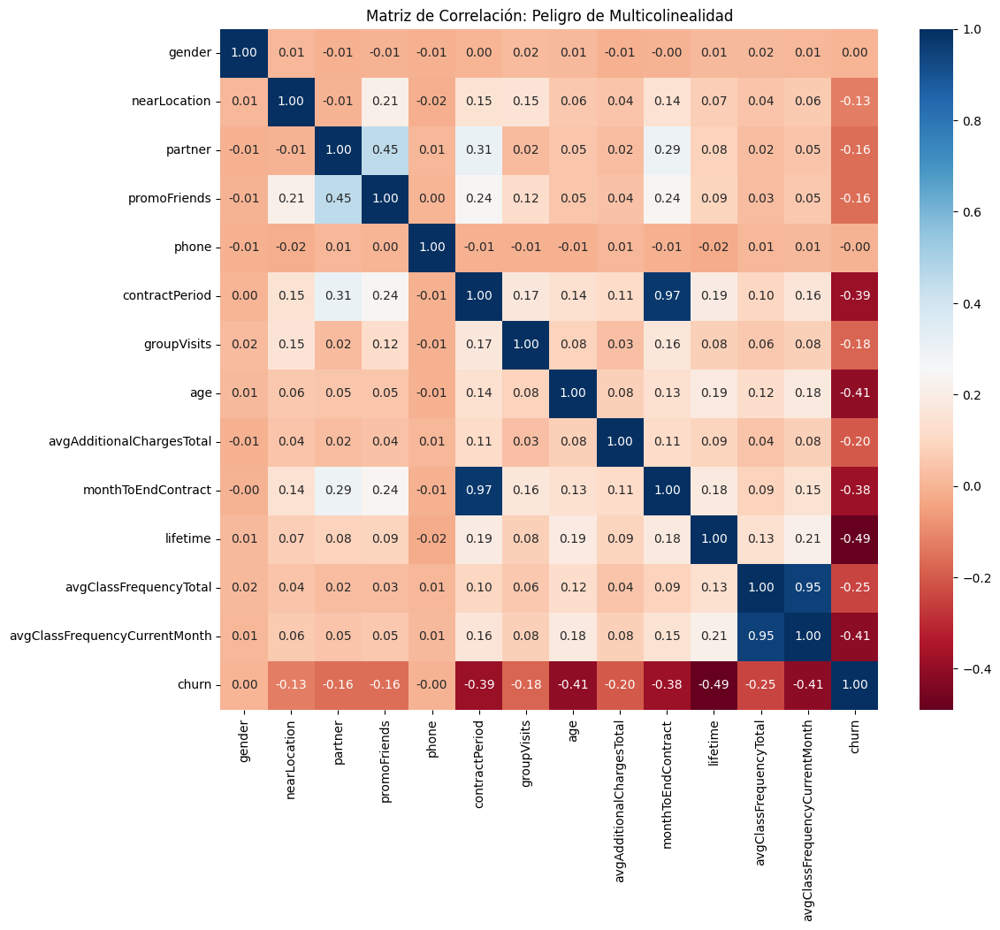
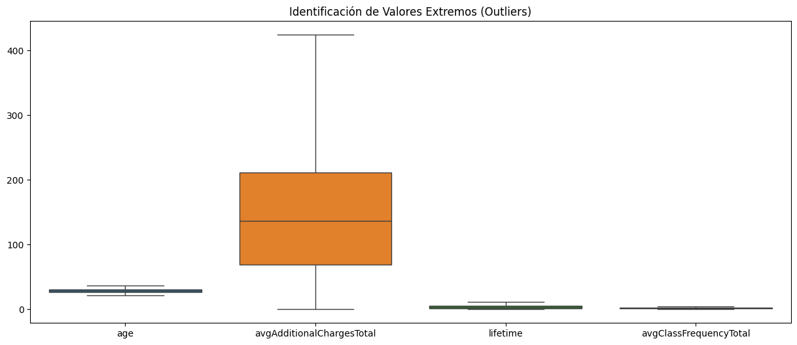
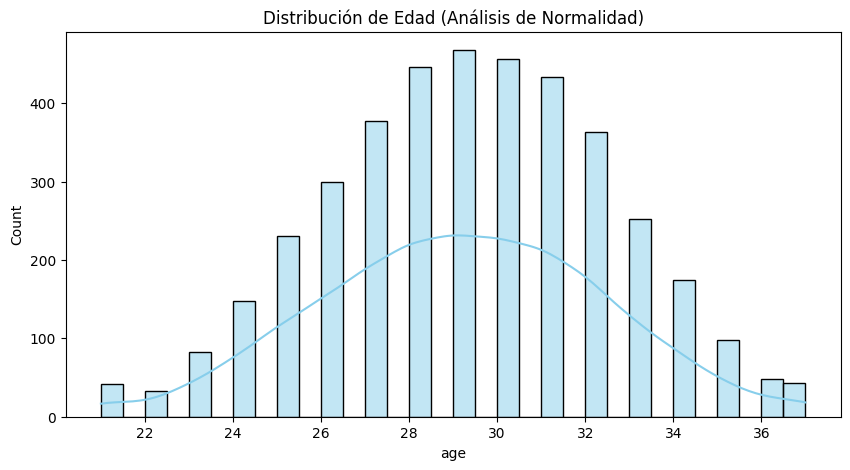
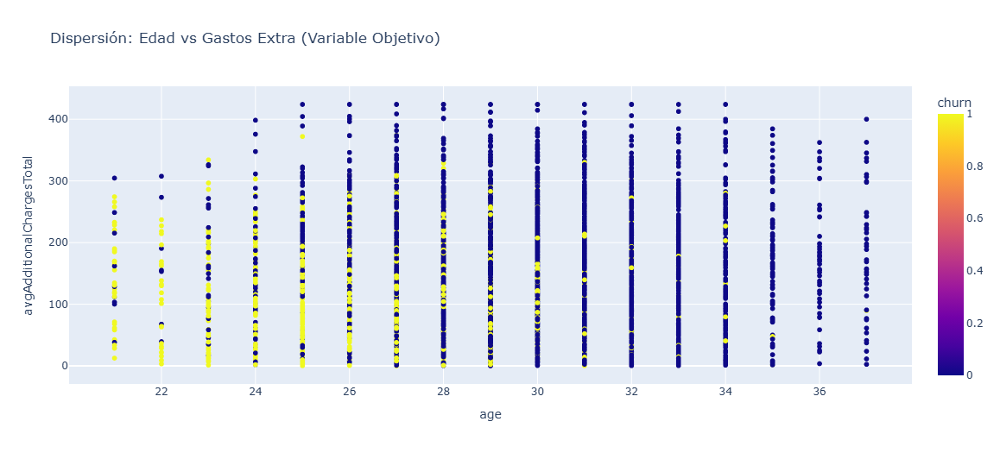

# ---

**Reporte Retención en Gimnasios**

**Proyecto:** Auditoría de Calidad y Análisis Exploratorio (EDA)

**Especialista:** BI & Data Science Team

## ---

**1\. Diccionarios de Datos (Data Catalog)**

### **1.1. Dataset Original (gym\_churn\_cleaned.csv)**

Este catálogo define la semántica de las variables utilizadas para el entrenamiento del modelo.

| Variable | Tipo | Descripción | Rango/Valores |
| ----- | ----- | ----- | ----- |
| gender | Booleano | Género del socio | $0$ (Mujer), $1$ (Hombre) |
| nearLocation | Booleano | Cercanía física a la sede | $0$ (Lejos), $1$ (Cerca) |
| partner | Booleano | Beneficiario de convenio corporativo | $0$ (No), $1$ (Sí) |
| promoFriends | Booleano | Registrado mediante referido | $0$ (No), $1$ (Sí) |
| contractPeriod | Entero | Duración del contrato actual | $1, 6, 12$ meses |
| age | Entero | Edad del socio | $\[18, 41\]$ años |
| avgAdditionalChargesTotal | Float | Gasto promedio en servicios extra | $\[0.14, 552.59\]$ |
| lifetime | Entero | Meses desde la inscripción | $\[0, 31\]$ meses |
| churn | Booleano | **Variable Objetivo**: Fuga del cliente | $0$ (Leal), $1$ (Fuga) |

### **1.2. Dataset Sintético (synthetic\_gym\_data.csv)**

Activo generado para pruebas de estrés y validación de tuberías de datos (Data Pipelines).

* **Metodología:** Generación estocástica basada en distribuciones observadas.  
* **Uso:** Pruebas de integración sin comprometer datos reales de clientes.

## ---

**2\. Resumen Estadístico (Insights de Negocio)**

Basado en el procesamiento de 4,000 registros, estos son los indicadores clave de tendencia y dispersión:

| Métrica | age | lifetime | avgAdditionalChargesTotal | churn |
| ----- | ----- | ----- | ----- | ----- |
| **Media ($\\mu$)** | $29.18$ | $3.52$ | $146.67$ | $0.26$ |
| **Mediana ($Q2$)** | $29.00$ | $3.00$ | $136.22$ | $0.00$ |
| **Moda** | $29.00$ | $1.00$ | $424.07$ | $0.00$ |
| **Desv. Estándar ($\\sigma$)** | $3.22$ | $3.11$ | $95.47$ | $0.44$ |
| **Sesgo (Skewness)** | $-0.05$ | $1.00$ | $0.55$ | $1.06$ |

**Interpretación BI:** \- La **Edad** es una variable de alta fidelidad con distribución normal ($\\mu \\approx Q2$).

* El **Lifetime** presenta un sesgo positivo marcado, indicando una alta concentración de usuarios nuevos y una "fuga temprana" crítica.

**\--- DIMENSIONALIDAD \--**\-  
Filas: 4000, 	Columnas: 14

**\--- ANÁLISIS DE TIPADO \---**

| Feature | Data Type |
| ----- | ----- |
| gender | int64 |
| nearLocation | int64 |
| partner | int64 |
| promoFriends | int64 |
| phone | int64 |
| contractPeriod | int64 |
| groupVisits | int64 |
| age | int64 |
| avgAdditionalChargesTotal | float64 |
| monthToEndContract | int64 |
| lifetime | int64 |
| avgClassFrequencyTotal | float64 |
| avgClassFrequencyCurrentMonth | float64 |
| churn | int64 |

**\--- CONTROL DE CALIDAD \---**  
Valores Nulos: 0  
Registros Duplicados: 0

**\--- RESUMEN ESTADÍSTICO \--**\-

| Feature | Mean | Median | Mode | Standard Deviation |
| ----- | ----- | ----- | ----- | ----- |
| **gender** | 0.510250 | 1.000000 | 1.000000 | 0.499957 |
| **nearLocation** | 0.845250 | 1.000000 | 1.000000 | 0.361711 |
| **partner** | 0.486750 | 0.000000 | 0.000000 | 0.499887 |
| **promoFriends** | 0.308500 | 0.000000 | 0.000000 | 0.461932 |
| **phone** | 0.903500 | 1.000000 | 1.000000 | 0.295313 |
| **contractPeriod** | 4.681250 | 1.000000 | 1.000000 | 4.549706 |
| **groupVisits** | 0.412250 | 0.000000 | 0.000000 | 0.492301 |
| **age** | 29.185250 | 29.000000 | 29.000000 | 3.228163 |
| **avgAdditionalChargesTotal** | 146.670520 | 136.220159 | 424.070817 | 95.475971 |
| **monthToEndContract** | 4.322750 | 1.000000 | 1.000000 | 4.191297 |
| **lifetime** | 3.526750 | 3.000000 | 1.000000 | 3.116523 |
| **avgClassFrequencyTotal** | 1.877530 | 1.832768 | 0.000000 | 0.967527 |
| **avgClassFrequencyCurrentMonth** | 1.766271 | 1.719574 | 0.000000 | 1.050333 |
| **churn** | 0.265250 | 0.000000 | 0.000000 | 0.441521 |

| Variable | Skewness |
| ----- | ----- |
| gender | \-0.041024 |
| nearLocation | \-1.909935 |
| partner | 0.053039 |
| promoFriends | 0.829541 |
| phone | \-2.734064 |
| contractPeriod | 0.712355 |
| groupVisits | 0.356667 |
| age | \-0.053759 |
| avgAdditionalChargesTotal | 0.552206 |
| monthToEndContract | 0.807789 |
| lifetime | 1.001347 |
| avgClassFrequencyTotal | 0.214183 |
| avgClassFrequencyCurrentMonth | 0.241720 |
| churn | 1.063900 |

\--- BALANCE DE LA VARIABLE OBJETIVO (CHURN) \---  
churn  
0    	73.475  
1    	26.525

\--- EJECUTANDO SANITY CHECK —

Nulos: 				✅ PASÓ  
Rango Edad Coherente: 	✅ PASÓ  
Churn Binario: 		✅ PASÓ  
Lifetime Positivo: 		✅ PASÓ

## ---

**3\. Análisis Visual y Hallazgos**

### **3.1. Matriz de Correlación (Heatmap)**

* **Hallazgo Crítico:** Existe una correlación de $r \= 0.97$ entre contractPeriod y monthToEndContract.  
* **Acción:** Esto indica **Multicolinealidad**. Para el modelo Random Forest, eliminaremos una de estas variables para evitar que el modelo asigne importancia redundante a la misma información.

### **3.2. Detección de Outliers (Boxplots)**

* Identificamos valores extremos en el gasto adicional y antigüedad.  
* **Decisión Estratégica:** No eliminar. Representan el segmento "VIP" o "Power Users", esenciales para entender la rentabilidad máxima.

### **3.3. Distribución Univariada**

* El $26.5\\%$ de la base de datos es churn=1. Aunque es una clase minoritaria, es suficiente para un entrenamiento robusto, pero se recomienda usar métricas como F1-Score en lugar de precisión simple.

### **3.4. Relación Lifetime vs Frecuencia**

* Se observa visualmente que los clientes que se fugan (rojo) tienden a tener un lifetime inferior a 5 meses y una frecuencia de asistencia menor a 2 veces por semana.

## ---

**4\. Reporte de Sanity Check (Calidad Asegurada)**

El script de validación automática arrojó los siguientes resultados antes del procesamiento:

1. **Integridad de Registros:** 4,000 filas procesadas con $0$ nulos y $0$ duplicados. ✅  
2. **Validación de Rango de Edad:** Todos los registros están en el rango biológico esperado ($18-100$). ✅  
3. **Consistencia de Objetivo:** La variable churn es estrictamente binaria $\\{0, 1\\}$. ✅  
4. **Validación de Negocio:** No existen valores negativos en cargos adicionales ni en antigüedad. ✅

## ---

**🚀 Conclusiones para el Modelo Predictivo**

1. **Evitar el ruido:** Se debe descartar monthToEndContract por redundancia.  
2. **Variables de Peso:** age, lifetime y avgClassFrequency se perfilan como los predictores más potentes.  
3. **Estrategia:** El modelo debe enfocarse en predecir la fuga en los primeros **3 meses**, que es donde el riesgo es estadísticamente más alto.

---

*Este documento constituye la base técnica para la fase de entrenamiento de Machine Learning.*
