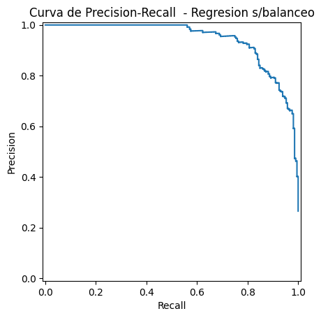
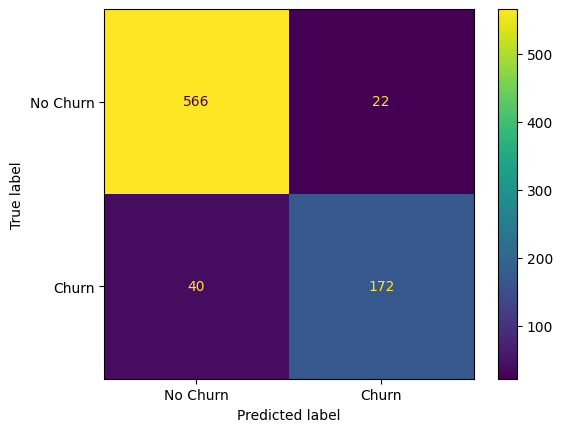
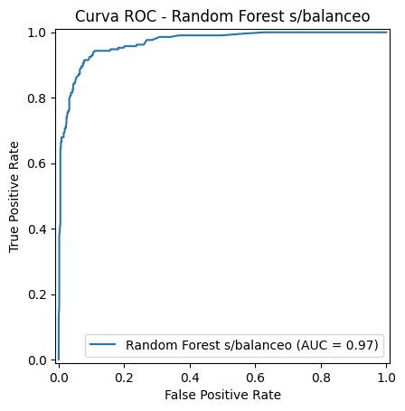
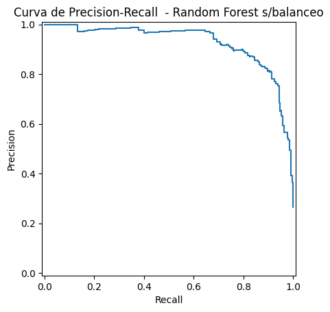
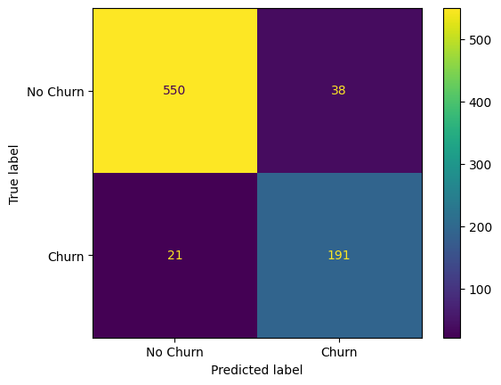
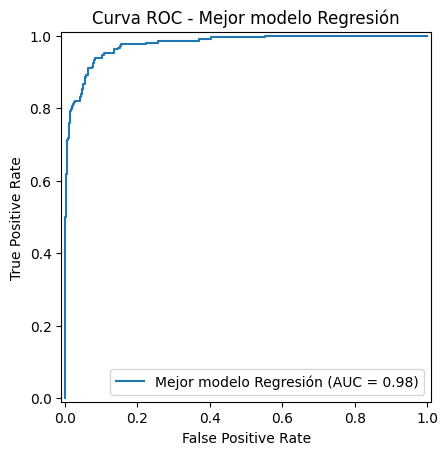
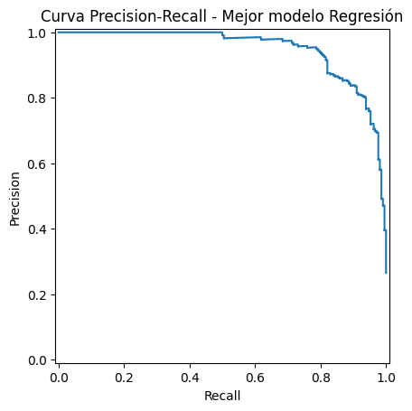
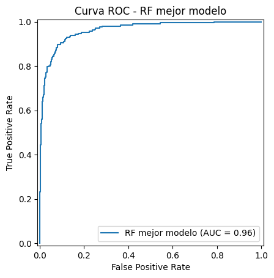
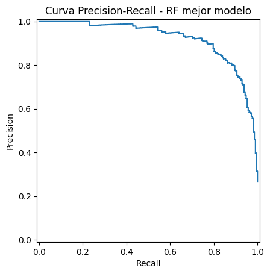

## Hackathon Oracle Next Education II - Latam

***Desafío intensivo de innovación para participantes de todo Latam.***

powered by 

----

# **04 \- Entrenamiento y Selección del Modelo (Gym Churn)**

## **📋 Descripción**

Este notebook documenta la fase de modelado predictivo para la detección de cancelación de clientes (*churn*).  
A diferencia de enfoques estándar, en este experimento se demostró que un modelo lineal bien calibrado (**Regresión Logística**) puede superar a modelos de ensamble complejos cuando se realiza una correcta ingeniería de características y ajuste de regularización.

## **🛠 Stack Tecnológico**

* **Lenguaje:** Python 3  
* **Librerías:**  
  * scikit-learn: Para la implementación de modelos y GridSearchCV.  
  * imbalanced-learn: Para el manejo de clases desbalanceadas con SMOTE.  
  * joblib: Para la exportación del modelo ganador.  
  * pandas, numpy, seaborn: Procesamiento y visualización.

## **🚀 Flujo de Trabajo y Modificaciones**

### **1\. Preprocesamiento Robusto**

* **Escalado:** Se aplicó StandardScaler rigurosamente, un paso crítico para que la Regresión Logística converja correctamente y asigne pesos justos a cada variable.  
* **Balanceo:** Implementación de **SMOTE** dentro de un Pipeline para evitar el sesgo hacia la clase mayoritaria (No Churn).

### **2\. Entrenamiento Comparativo**

Se evaluaron distintos algoritmos:

<details>
  <summary> <strong>Baseline:</strong>Dummy Classifier.</summary>
  El modelo base se construyó utilizando `DummyClassifier` con la estrategia `most_frequent`, lo que implica que el algoritmo predice siempre la clase mayoritaria observada en el conjunto de entrenamiento. Este tipo de modelo no aprende patrones reales; su función es establecer una **línea mínima de desempeño** contra la cual comparar todos los modelos posteriores.

  #### Resultados
  El modelo clasifica todos los registros como clase `0` (no churn), ignorando completamente la clase minoritaria.

  

  #### **Reporte de Clasificación:**

  | Clase | Precision | Recall | F1-score | Support |
  |-------|-----------|--------|----------|---------|
  | 0     | 0.73      | 1.00   | 0.85     | 588     |
  | 1     | 0.00      | 0.00   | 0.00     | 212     |

  - *Accuracy*: **0.73**
  - *Recall clase 1 (churn)*: **0.00**

  #### Interpretación Inicial

  Aunque el modelo alcanza una precisión global del 73%, este valor es engañoso: se debe únicamente a que la clase mayoritaria representa la mayor parte del conjunto de prueba. El modelo es incapaz de detectar casos de churn, con un *recall* de **0.00** para la clase objetivo.

  Este comportamiento confirma dos aspectos clave:

  1. El problema presenta un **desbalance significativo** entre clases.
  2. La métrica de *accuracy* por sí sola no es adecuada para evaluar el desempeño del sistema.

  El Dummy Classifier se utilizó para establecer un punto de referencia mínimo. Los modelos subsecuentes se generaron para superar este comportamiento trivial, especialmente en la capacidad de identificar correctamente a los clientes que abandonan.
</details>

<details>
  <summary> <strong>Lineal:</strong>Logistic Regression.</summary>
    
    Este primer modelo real se entrenó utilizando `LogisticRegression` con dos ajustes clave:

  - `max_iter=2000`, para asegurar la convergencia del algoritmo.
  - `class_weight='balanced'`, que repondera automáticamente las clases en función de su frecuencia, mitigando el efecto del desbalance sin modificar explícitamente los datos.

  A diferencia del Dummy, este modelo sí aprende relaciones entre las variables predictoras y la variable objetivo.

  #### Resultados: 

  **Reporte de Clasificación:**

  

  | Clase | Precision | Recall | F1-score | Support |
  |-------|-----------|--------|----------|---------|
  | 0     | 0.96      | 0.92   | 0.94     | 588     |
  | 1     | 0.80      | 0.89   | 0.84     | 212     |

  - *Accuracy*: **0.91**
  - *Precision (clase 1)*: **0.80**
  - *Recall (clase 1)*: **0.89**
  - *F1 (clase 1)*: **0.84**

  

  

  Este modelo representa un salto cualitativo frente al baseline. A diferencia del Dummy, la regresión logística logra identificar eficazmente la clase minoritaria:

  - El *recall* de **0.89** en la clase `1` indica que el modelo detecta la gran mayoría de los casos de churn.
  - La *precision* de **0.80** muestra que, aunque existen falsos positivos, la mayoría de las predicciones de churn son correctas.
  - La *accuracy* global del **91%** ya no es producto del azar, sino del aprendizaje efectivo de patrones.

  El uso de `class_weight='balanced'` demuestra ser una estrategia funcional para abordar el desbalance sin recurrir aún a técnicas de remuestreo. 

--- 
  ### Evaluación con Datos Balanceados y Validación Cruzada

  Al entrenar la Regresión Logística sobre datos previamente balanceados (sin `class_weight`), se observa un comportamiento consistente con el modelo ponderado:

  - *Recall (clase 1)*: **0.87**
  - *Precision (clase 1)*: **0.82**
  - *F1 (clase 1)*: **0.85**
  - *Accuracy*: **0.92**

  Estos valores son comparables a los obtenidos con `class_weight='balanced'`, lo que indica que ambas estrategias (reponderación interna vs. balanceo explícito) permiten al modelo aprender patrones útiles para la clase minoritaria. Sin embargo, el balanceo explícito introduce un ligero intercambio entre *recall* y *precision*, manteniendo un F1 estable.

  La validación cruzada con `StratifiedKFold` y `Pipeline` refuerza esta lectura:

  | Métrica        | Media | Desv. Std |
  |----------------|-------|-----------|
  | Accuracy       | 0.93  | 0.01      |
  | Precision      | 0.88  | 0.02      |
  | Recall         | 0.84  | 0.02      |
  | F1             | 0.86  | 0.02      |

  La baja desviación estándar evidencia un desempeño **estable y generalizable** entre particiones. Este paso es crítico, ya que evita conclusiones basadas en una sola partición del dataset y confirma que el modelo mantiene su capacidad predictiva en distintos subconjuntos.

  En conjunto, estas evaluaciones muestran que:
  - El modelo es robusto frente al desbalance.
  - El rendimiento no es circunstancial.
  - Existen bases sólidas para avanzar hacia una fase de optimización más fina (variables e hiperparámetros).

  Este enfoque reduce el riesgo de sobreajuste y asegura que las mejoras posteriores se construyan sobre un comportamiento consistente y confiable.

</details>

<details>
  <summary> <strong>Ensamble: </strong>Random Forest Classifier.</summary>
  
  El modelo Random Forest se entrenó inicialmente con `n_estimators=300` y `class_weight='balanced'`, buscando aprovechar su capacidad para modelar relaciones no lineales y mitigar el desbalance desde el propio algoritmo.

  #### Resultados: 
  

  **Reporte de Clasificación:**

  | Clase | Precision | Recall | F1-score | Support |
  |-------|-----------|--------|----------|---------|
  | 0     | 0.93      | 0.96   | 0.95     | 588     |
  | 1     | 0.89      | 0.81   | 0.85     | 212     |

  

  

  - *Accuracy*: **0.92**
  - *Recall (clase 1)*: **0.81**
  - *Precision (clase 1)*: **0.89**
  - *F1 (clase 1)*: **0.85**

  El modelo logra un desempeño sólido desde su configuración inicial, superando ampliamente al baseline y mostrando una alta precisión para ambas clases. No obstante, el *recall* en la clase minoritaria revela que aún existe margen para mejorar la detección de churn.

  ---

  ### Evaluación con Datos Balanceados y Validación Cruzada

  Tras aplicar balanceo explícito al conjunto de entrenamiento, el modelo se reentrena bajo la misma configuración:

  | Clase | Precision | Recall | F1-score | Support |
  |-------|-----------|--------|----------|---------|
  | 0     | 0.95      | 0.95   | 0.95     | 588     |
  | 1     | 0.85      | 0.85   | 0.85     | 212     |

  - *Accuracy*: **0.92**
  - *Recall (clase 1)*: **0.85**
  - *Precision (clase 1)*: **0.85**
  - *F1 (clase 1)*: **0.85**

  El balanceo produce un efecto de **compensación**: el *recall* de la clase minoritaria mejora, mientras que la *precision* se ajusta ligeramente. El resultado es un comportamiento más simétrico entre clases, manteniendo la estabilidad global del modelo.

  La evaluación con validación cruzada refuerza la robustez del enfoque:

  | Métrica   | Media | Desv. Std |
  |-----------|-------|-----------|
  | Accuracy  | 0.91  | 0.02      |
  | Precision | 0.83  | 0.03      |
  | Recall    | 0.84  | 0.02      |
  | F1        | 0.83  | 0.03      |

  La baja variabilidad entre particiones confirma que el desempeño no depende de una sola división del dataset. El modelo mantiene un equilibrio estable entre *precision* y *recall*, especialmente en la clase de churn.

  Por lo tanto, este modelo muestra desde el inicio un desempeño competitivo y estable. El uso de datos balanceados no incrementa drásticamente la *accuracy*, pero sí ajusta el comportamiento del modelo hacia una detección más equitativa entre clases. La validación cruzada confirma que este rendimiento es consistente y generalizable.

  Estos resultados posicionan al Random Forest como un candidato sólido para la fase de optimización, donde el ajuste fino de hiperparámetros puede orientarse específicamente a maximizar el *recall* de churn sin comprometer la estabilidad global del sistema.
</details>


### **3\. Optimización de los modelos**

Se realizó una optimización de cada uno de los modelos. Basado en los resultados obtenidos, se puede señalar lo siguiente:

<details>
  <summary>
    <em>El modelo de Regresión Logística muestra un equilibrio entre Precision y Recall</em>
  </summary>
  
  #### *Optimización del Modelo*

  El proceso de optimización se centró en mejorar el desempeño del modelo a partir de tres ejes: <strong>relevancia de variables, estabilidad estadística y ajuste fino de hiperparámetros.</strong>

  ### 1. Selección de Variables por Importancia

  Mediante `permutation_importance` con métrica `recall`, se identificaron variables cuyo aporte al modelo era nulo o negativo:

  | Variable       | Importancia Media |
  |----------------|-------------------|
  | phone          | -0.0009           |
  | nearLocation   | -0.0014           |
  | gender         | -0.0016           |

  Estas variables fueron eliminadas al no contribuir a la detección de churn.

  ### 2. *Análisis de Multicolinealidad*

  Se evaluó la multicolinealidad mediante el Factor de Inflación de Varianza (VIF), detectando valores elevados en:

  | Variable            | VIF   |
  |---------------------|-------|
  | contractPeriod      | 21.83 |
  | monthToEndContract  | 21.58 |

  Para evitar redundancia y ruido estadístico, se eliminó `contractPeriod`, conservando `monthToEndContract`.

  ### 3. *Reentrenamiento con Variables Reducidas*

  El modelo fue reentrenado con 9 variables. El desempeño resultante mostró una mejora ligera pero consistente:

  | Clase | Precision | Recall | F1-score |
  |-------|-----------|--------|----------|
  | 0     | 0.96      | 0.94   | 0.95     |
  | 1     | 0.83      | 0.90   | 0.87     |

  - *Accuracy*: **0.93**
  - *Recall (churn)*: **0.90**

  Esto confirma que la reducción de variables no solo preserva el rendimiento, sino que mejora la capacidad de detección de la clase minoritaria.

  ### 4. *Optimización de Hiperparámetros*

  Se aplicó `GridSearchCV` priorizando la métrica `roc_auc`, buscando un equilibrio entre *precision* y *recall*.  
  El mejor conjunto de parámetros fue:

  ```python
  {
    'model__C': 1,
    'model__class_weight': None,
    'model__max_iter': 2000,
    'model__penalty': 'l2',
    'model__solver': 'lbfgs'
  }
  ```
  El modelo final obtuvo:

  

  - *Accuracy:* **0.93**
  - *Recall (churn):* **0.90**
  - *F1 (churn):* **0.87**
  - *ROC AUC:* **0.98**

  

  

  Estos resultados evidencian un modelo altamente discriminativo, estable y optimizado para identificar clientes con riesgo de abandono, manteniendo un equilibrio sólido entre sensibilidad y precisión.

</details>

<details>
  <summary>
  <em>Random Forest es estable y consistente, pero capacidad limitado para superar a la regresión logística, incluso tras la optimización por hiperparámetros.</em>
  </summary>

  #### Optimización del Modelo Random Forest

  El proceso inició con un análisis de importancia de variables mediante *permutation importance*. Se identificaron variables con aportación nula o negativa (`partner`, `nearLocation`, `avgClassFrequencyTotal`, `gender`). No obstante, al evaluar distintos escenarios de eliminación, se observó que la mayoría de estas variables sí contribuían indirectamente al desempeño del modelo, ya que su remoción degradaba las métricas.

  Como resultado, únicamente se eliminó la variable `phone`, al confirmarse que no aportaba valor al entrenamiento. El modelo reentrenado mantuvo un comportamiento muy similar al inicial:

  | Clase | Precision | Recall | F1-score |
  |-------|-----------|--------|----------|
  | 0     | 0.94      | 0.93   | 0.93     |
  | 1     | 0.81      | 0.83   | 0.82     |

  - *Accuracy*: **0.90**

  Este resultado confirmó que Random Forest depende de la interacción conjunta de la mayoría de las variables y que la reducción agresiva del espacio de atributos no es favorable para este método.

  Posteriormente, se procedió a la optimización del modelo mediante `GridSearchCV`, integrando:

  - Preprocesamiento con `ColumnTransformer`.
  - Balanceo con `SMOTE` dentro del `Pipeline`.
  - Validación cruzada estratificada (5-fold).
  - Optimización dirigida a *recall*.

  El mejor conjunto de hiperparámetros fue:

  ```python
  {
    'model__bootstrap': True,
    'model__max_depth': 10,
    'model__max_features': 'sqrt',
    'model__min_samples_leaf': 5,
    'model__min_samples_split': 2,
    'model__n_estimators': 200
  }
  ```
  Aunque el best_score_ alcanzó 0.8669, el desempeño final del modelo fue:

  

  | Clase | Precision | Recall | F1-score |
  |-------|-----------|--------|----------|
  | 0     | 0.95      | 0.93   | 0.94     |
  | 1     | 0.82      | 0.86   | 0.84     |

  - *Accuracy*: **0.90**

  

  

  La optimización permitió mejorar ligeramente el recall de churn y estabilizar el comportamiento del modelo, pero sin generar una ventaja clara frente a la configuración inicial ni frente a la regresión logística.
</details>

## 📊 Resultados: Selección del Modelo Final

Aunque los modelos basados en árboles suelen ofrecer un alto poder predictivo, en este problema la **Regresión Logística Optimizada** logró un mejor equilibrio entre complejidad y capacidad de generalización. El modelo alcanzó el mayor *Recall* para la clase de churn, manteniendo al mismo tiempo un desempeño global superior.

| Modelo | Accuracy | Precision | Recall | F1-Score |
| :---- | :---- | :---- | :---- | :---- |
| Random Forest | 91.0% | 82.0% | 86.0% | 84.0% |
| Logistic Regression (Base) | 91.0% | 80.0% | 89.0% | 84.2% |
| **Logistic Regression (Optimizada)** | **93.0%** | **83.0%** | **90.0%** | **87.0%** |

**Conclusión:**  
La Regresión Logística optimizada fue seleccionada como modelo final al ofrecer el mejor desempeño en la detección de clientes en riesgo (*Recall = 90%*), métrica clave para el objetivo del proyecto. Adicionalmente, aporta ventajas prácticas en entornos reales: interpretabilidad directa de los coeficientes, menor riesgo de sobreajuste y mayor eficiencia computacional en producción.

Este resultado confirma que, para este dominio, un modelo lineal bien regularizado supera a enfoques más complejos, proporcionando una solución más robusta, transparente y alineada al impacto de negocio.


## **📂 Archivos Generados**

* 💹 **Modelo base de entremiento**
        [dummy_baseline.joblib](../models/dummy_baseline.joblib) 

 * 🥇 **Modelo Optimizado de Regresión Logísitica**
        [Regresion_modelo_champion.joblib](../models/Regresion_modelo_champion.joblib)
    
  * 🥈 **Modelo random Forest para respaldo al ejecutar API**
        [RF_modelo_champion.joblib](../models/RF_modelo_champion.joblib)

  * 📓 **Jupyter Notebook utilizado durante entrenamiento**
        [05.-Optimización_de_gym_churn_camelcase_train.ipynb](../notebooks/05.-%20Optimización_de_gym_churn_camelcase_train.ipynb)

    


## **🏁 Uso del Modelo**

```python

import joblib

\# Cargar el modelo ganador  
modelo \= joblib.load('models/Regresion_modelo_champion.joblib')

\# Obtener probabilidades de churn  
\# (El modelo ya incluye el escalado internamente si se guardó como Pipeline)  
probabilidades \= modelo.predict\_proba(nuevos\_datos)\[:, 1\]  
```
