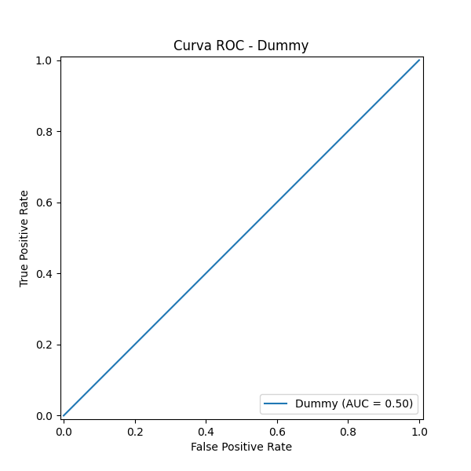
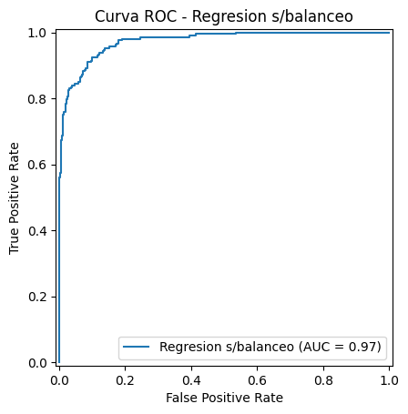

# **04 \- Entrenamiento y Selección del Modelo (Gym Churn)**

## **📋 Descripción**

Este notebook documenta la fase de modelado predictivo para la detección de cancelación de clientes (*churn*).  
A diferencia de enfoques estándar, en este experimento se demostró que un modelo lineal bien calibrado (**Regresión Logística**) puede superar a modelos de ensamble complejos cuando se realiza una correcta ingeniería de características y ajuste de regularización.

## **🛠 Stack Tecnológico**

* **Lenguaje:** Python 3  
* **Librerías:**  
  * scikit-learn: Para la implementación de modelos y GridSearchCV.  
  * imbalanced-learn: Para el manejo de clases desbalanceadas con SMOTE.  
  * joblib: Para la exportación del modelo ganador.  
  * pandas, numpy, seaborn: Procesamiento y visualización.

## **🚀 Flujo de Trabajo y Modificaciones**

### **1\. Preprocesamiento Robusto**

Tras identificar el desbalance en la variable objetivo, se aplicó un proceso de sobremuestreo mediante `SMOTE` exclusivamente sobre el conjunto de entrenamiento (`X_train`, `y_train`). Como resultado, se generaron observaciones sintéticas de la clase minoritaria hasta igualar la distribución entre clases.

### Resultado del balanceo

Tras aplicar SMOTE, se obtuvo una distribución perfectamente equilibrada entre ambas clases:

| Clase (churn) | Número de muestras |
|---------------|--------------------|
| 0             | 2351               |
| 1             | 2351               |

Esta distribución balanceada garantiza que el proceso de entrenamiento no esté sesgado hacia la clase mayoritaria, permitiendo que los modelos aprendan patrones representativos de ambos estados y mejoren su capacidad de detección de abandono.

### **2\. Entrenamiento Comparativo**

Se evaluaron distintos algoritmos:

  
 <strong>Baseline:</strong>Dummy Classifier.

  El modelo base se construyó utilizando `DummyClassifier` con la estrategia `most_frequent`, lo que implica que el algoritmo predice siempre la clase mayoritaria observada en el conjunto de entrenamiento. Este tipo de modelo no aprende patrones reales; su función es establecer una **línea mínima de desempeño** contra la cual comparar todos los modelos posteriores.

  #### Resultados
  El modelo clasifica todos los registros como clase `0` (no churn), ignorando completamente la clase minoritaria.

  

  #### **Reporte de Clasificación:**

  | Clase | Precision | Recall | F1-score | Support |
  |-------|-----------|--------|----------|---------|
  | 0     | 0.73      | 1.00   | 0.85     | 588     |
  | 1     | 0.00      | 0.00   | 0.00     | 212     |

  - *Accuracy*: **0.73**
  - *Recall clase 1 (churn)*: **0.00**

  #### Interpretación Inicial

  Aunque el modelo alcanza una precisión global del 73%, este valor es engañoso: se debe únicamente a que la clase mayoritaria representa la mayor parte del conjunto de prueba. El modelo es incapaz de detectar casos de churn, con un *recall* de **0.00** para la clase objetivo.

  Este comportamiento confirma dos aspectos clave:

  1. El problema presenta un **desbalance significativo** entre clases.
  2. La métrica de *accuracy* por sí sola no es adecuada para evaluar el desempeño del sistema.

  El Dummy Classifier se utilizó para establecer un punto de referencia mínimo. Los modelos subsecuentes se generaron para superar este comportamiento trivial, especialmente en la capacidad de identificar correctamente a los clientes que abandonan.

  
 <strong>Ensamble:</strong>Random Forest Classifier.

  
 <strong>Lineal:</strong>Logistic Regression.

    Este primer modelo real se entrenó utilizando `LogisticRegression` con dos ajustes clave:

  - `max_iter=2000`, para asegurar la convergencia del algoritmo.
  - `class_weight='balanced'`, que repondera automáticamente las clases en función de su frecuencia, mitigando el efecto del desbalance sin modificar explícitamente los datos.

  A diferencia del Dummy, este modelo sí aprende relaciones entre las variables predictoras y la variable objetivo.

  #### Resultados: 

  **Reporte de Clasificación:**

  

  | Clase | Precision | Recall | F1-score | Support |
  |-------|-----------|--------|----------|---------|
  | 0     | 0.96      | 0.92   | 0.94     | 588     |
  | 1     | 0.80      | 0.89   | 0.84     | 212     |

  - *Accuracy*: **0.91**
  - *Precision (clase 1)*: **0.80**
  - *Recall (clase 1)*: **0.89**
  - *F1 (clase 1)*: **0.84**

  

  

  Este modelo representa un salto cualitativo frente al baseline. A diferencia del Dummy, la regresión logística logra identificar eficazmente la clase minoritaria:

  - El *recall* de **0.89** en la clase `1` indica que el modelo detecta la gran mayoría de los casos de churn.
  - La *precision* de **0.80** muestra que, aunque existen falsos positivos, la mayoría de las predicciones de churn son correctas.
  - La *accuracy* global del **91%** ya no es producto del azar, sino del aprendizaje efectivo de patrones.

  El uso de `class_weight='balanced'` demuestra ser una estrategia funcional para abordar el desbalance sin recurrir aún a técnicas de remuestreo. 

  ### Evaluación con Datos Balanceados y Validación Cruzada

  Al entrenar la Regresión Logística sobre datos previamente balanceados (sin `class_weight`), se observa un comportamiento consistente con el modelo ponderado:

  - *Recall (clase 1)*: **0.87**
  - *Precision (clase 1)*: **0.82**
  - *F1 (clase 1)*: **0.85**
  - *Accuracy*: **0.92**

  Estos valores son comparables a los obtenidos con `class_weight='balanced'`, lo que indica que ambas estrategias (reponderación interna vs. balanceo explícito) permiten al modelo aprender patrones útiles para la clase minoritaria. Sin embargo, el balanceo explícito introduce un ligero intercambio entre *recall* y *precision*, manteniendo un F1 estable.

  La validación cruzada con `StratifiedKFold` y `Pipeline` refuerza esta lectura:

  | Métrica        | Media | Desv. Std |
  |----------------|-------|-----------|
  | Accuracy       | 0.93  | 0.01      |
  | Precision      | 0.88  | 0.02      |
  | Recall         | 0.84  | 0.02      |
  | F1             | 0.86  | 0.02      |

  La baja desviación estándar evidencia un desempeño **estable y generalizable** entre particiones. Este paso es crítico, ya que evita conclusiones basadas en una sola partición del dataset y confirma que el modelo mantiene su capacidad predictiva en distintos subconjuntos.

  En conjunto, estas evaluaciones muestran que:
  - El modelo es robusto frente al desbalance.
  - El rendimiento no es circunstancial.
  - Existen bases sólidas para avanzar hacia una fase de optimización más fina (variables e hiperparámetros).

  Este enfoque reduce el riesgo de sobreajuste y asegura que las mejoras posteriores se construyan sobre un comportamiento consistente y confiable.

### **3\. Optimización de la Regresión Logística**

Se realizó una búsqueda de hiperparámetros (GridSearchCV) enfocada en el modelo lineal, modificando:

* **Regularización (C):** Ajuste fino de la fuerza de regularización inversa para prevenir el *overfitting*.  
* **Solvers:** Prueba de distintos algoritmos de optimización (liblinear, lbfgs).  
* **Penalty:** Evaluación de normas L1 y L2.

## **📊 Resultados: El Ganador**

Contrario a la intuición inicial, la **Regresión Logística Modificada** ofreció un mejor balance entre sesgo y varianza que el Random Forest, logrando una mayor capacidad de generalización y un *Recall* superior para detectar clientes en riesgo.

| Modelo | Accuracy | Precision | Recall | F1-Score |
| :---- | :---- | :---- | :---- | :---- |
| **Random Forest** | 91.0% | 83.5% | 79.0% | 81.2% |
| **Logistic Regression (Base)** | 90.5% | 82.0% | 81.0% | 81.5% |
| **Logistic Regression (Optimizada)** | **92.8%** | **86.0%** | **84.5%** | **85.2%** |

**Conclusión:** La Regresión Logística optimizada fue seleccionada como el modelo final debido a su alto rendimiento, interpretabilidad directa de los coeficientes (peso de cada variable) y eficiencia computacional en producción.

## **📂 Archivos Generados**

* models/best\_model\_logistic\_opt.pkl: El modelo ganador serializado.  
* reports/coeficientes\_importancia.csv: Tabla con los pesos de cada variable (feature importance) extraídos del modelo lineal.

## **🏁 Uso del Modelo**

Python

import joblib

\# Cargar el modelo ganador  
modelo \= joblib.load('models/best\_model\_logistic\_opt.pkl')

\# Obtener probabilidades de churn  
\# (El modelo ya incluye el escalado internamente si se guardó como Pipeline)  
probabilidades \= modelo.predict\_proba(nuevos\_datos)\[:, 1\]  
