## Hackathon Oracle Next Education II - Latam

***Desafío intensivo de innovación para participantes de todo Latam.***

powered by 

----

#  ChurnCheck
## Predicción de Cancelación de Clientes

* Proyecto ChurnInsight
* **Equipo: H12-25-L-Equipo 14-Data Science**

-----

#### [Resumen Ejecutivo](#especificación-técnica-1)

#### [Especificación Técnica](#especificación-técnica-1)

Repositorio de código y documentación de desarrollo: [https://github.com/sjlvanq/nc-oneiila-e14b](https://github.com/sjlvanq/nc-oneiila-e14b)

---

# Resumen Ejecutivo

**Proyecto:** ChurnCheck – Plataforma Analítica para la Predicción de Abandono de Clientes

## Índice de contenidos
1. [Contexto y Problemática](#1-contexto-y-problemática)
2. [Objetivo del Proyecto](#2-objetivo-del-proyecto)
3. [Descripción General de la Solución](#3-descripción-general-de-la-solución)
4. [Pilar 1: Data Science](#4-pilar-1-data-science)
5. [Pilar 2: Backend](#5-pilar-2-backend)
6. [Pilar 3: Frontend](#6-pilar-3-frontend)
7. [Equipo de Trabajo](#7-equipo-de-trabajo)
8. [Conclusión Ejecutiva](#8-conclusión-ejecutiva)

## 1. Contexto y Problemática

En los modelos de negocio basados en suscripción, la retención de clientes es un factor determinante para la sostenibilidad financiera de las organizaciones. Sectores como gimnasios y academias enfrentan tasas de abandono (*churn*) particularmente elevadas durante los primeros meses de afiliación, etapa crítica en la que los clientes aún no consolidan un hábito de consumo. Este fenómeno impacta directamente en el flujo de caja, incrementa los costos de adquisición de nuevos clientes y dificulta la planificación estratégica.

Ante esta problemática, surge **ChurnCheck**, una solución tecnológica integral desarrollada en el contexto de un hackathon, cuyo objetivo es anticipar el abandono de clientes mediante el uso de analítica predictiva y visualización clara de información. El proyecto adopta un enfoque *data-driven*, en el cual los datos se convierten en el principal insumo para la toma de decisiones estratégicas.

## 2. Objetivo del Proyecto

El objetivo principal de **ChurnCheck** es desarrollar una plataforma analítica de alerta temprana capaz de identificar clientes con alto riesgo de abandono, permitiendo a las organizaciones ejecutar acciones preventivas de retención de manera oportuna.

Para alcanzar este objetivo, el proyecto se estructura sobre tres pilares fundamentales:

- **Data Science**, como generador de la inteligencia predictiva.  
- **Backend**, como núcleo lógico y de orquestación del sistema.  
- **Frontend**, como capa de visualización e interacción con el usuario final.  

Estos componentes trabajan de forma integrada, pero desacoplada, garantizando escalabilidad, mantenibilidad y claridad arquitectónica.

## 3. Descripción General de la Solución

ChurnCheck es una plataforma analítica que transforma datos históricos de clientes calculados de forma dinámica en información accionable. El flujo general del sistema sigue el principio:

**Datos → Análisis → Decisión**

El sistema analiza variables relacionadas con la antigüedad del cliente, frecuencia de asistencia, tipo de contrato y comportamiento de consumo, con el fin de estimar la probabilidad de abandono en tiempo real. Esta información es presentada al usuario mediante un *dashboard* visual, facilitando la identificación de clientes prioritarios y apoyando la toma de decisiones estratégicas.

## 4. Pilar 1: Data Science

El módulo de Data Science constituye el núcleo analítico del proyecto. A partir del dataset `gym_churn_us.csv`, el equipo llevó a cabo un ciclo completo de ciencia de datos que incluyó:

- Limpieza y saneamiento del dataset.  
- Análisis Exploratorio de Datos (EDA) para la identificación de patrones relevantes.  
- Transformación y estandarización de variables.  
- Entrenamiento y evaluación de modelos de *machine learning*.  

Tras comparar distintos algoritmos, se seleccionó una **Regresión Logística optimizada**, debido a su equilibrio entre rendimiento, interpretabilidad y eficiencia computacional. El modelo alcanzó métricas destacadas (accuracy superior al 90% y un recall elevado), lo que valida su capacidad para identificar clientes en riesgo de abandono.

El modelo fue desplegado como un microservicio mediante una **API REST** construida con **FastAPI** y containerizada con **Docker**, permitiendo su consumo en tiempo real por otros componentes del sistema.

## 5. Pilar 2: Backend

El backend de ChurnCheck actúa como el motor lógico y de integración del sistema. Su función principal es centralizar la lógica de negocio y orquestar la comunicación entre el módulo de Data Science y el frontend.

Desarrollado con **Java 21** y **Spring Boot 3**, el backend implementa:

- Servicios REST para el consumo de datos.  
- Integración con el modelo predictivo como servicio externo.  
- Persistencia de datos mediante una base de datos **H2**.
- Seguridad basada en autenticación *stateless* mediante **JWT**.  

Este enfoque desacoplado permite que el sistema continúe siendo estable incluso ante latencias o fallos temporales del módulo analítico.

## 6. Pilar 3: Frontend

El frontend constituye la capa de presentación y el punto de contacto directo con el usuario. Su objetivo es traducir resultados analíticos complejos en información visual clara y comprensible.

Desarrollado con **HTML, CSS, JavaScript, Chart.js y Vite**, el frontend presenta un *dashboard* analítico que permite:

- Visualizar probabilidades de *churn*.  
- Clasificar clientes por nivel de riesgo.  
- Identificar clientes prioritarios mediante indicadores visuales y gráficos interactivos.  

El frontend consume la API REST del backend, manteniendo una estricta separación de responsabilidades y garantizando una experiencia de usuario fluida e intuitiva.

## 7. Equipo de Trabajo

El desarrollo de ChurnCheck fue posible gracias al trabajo colaborativo de un equipo multidisciplinario, donde cada integrante aportó desde su especialidad:

**Equipo H12-25-L – Equipo 14 Data Science**

- Gabriel Abdenago Blanco Acurero – Data Scientist  
- Wilson Arturo Acevedo Molinares – Data Scientist  
- Oriana Ortiz Novoa – Data Scientist  
- Mario Martínez – Data Scientist  
- Miguel Castillo – Data Engineer  
- Miguel Figueroa Aguilar – Data Engineer  
- Iris Criseida Hernández Rodríguez – Backend Developer  
- Silvano Emanuel Roques – Backend Developer  
- Luis Erwin Condori Mamani – Backend Developer  

## 8. Conclusión Ejecutiva

ChurnCheck demuestra que una solución basada en analítica predictiva, respaldada por una arquitectura backend robusta y presentada mediante un frontend claro y funcional, puede transformar datos en decisiones estratégicas de alto impacto. A pesar de haber sido desarrollado en el contexto de un hackathon, el proyecto presenta una base técnica sólida, escalable y alineada con estándares profesionales, lo que lo convierte en una propuesta viable para evolucionar hacia entornos productivos reales.

-----

# Especificación técnica

## Índice de Contenidos

1. [Introducción](#1-introducción)
2. [Contexto del Proyecto y Objetivos](#2-contexto-del-proyecto-y-objetivos)
   - [2.1 Contexto del Hackathon](#21-contexto-del-hackathon)
   - [2.2 Objetivo General](#22-objetivo-general)
   - [2.3 Objetivos Específicos](#23-objetivos-específicos)
3. [Descripción General del Sistema](#3-descripción-general-del-sistema)
4. [Arquitectura General del Sistema](#4-arquitectura-general-del-sistema)
5. [Módulo de Data Science](#5-módulo-de-data-science)
   - [5.1 Rol del Data Science en ChurnCheck](#51-rol-del-data-science-en-churncheck)
   - [5.2 Dataset y Comprensión de los Datos](#52-dataset-y-comprensión-de-los-datos)
   - [5.3 Limpieza y Preparación de Datos](#53-limpieza-y-preparación-de-datos)
   - [5.4 Análisis Exploratorio de Datos (EDA)](#54-análisis-exploratorio-de-datos-eda)
   - [5.5 Selección y Entrenamiento del Modelo](#55-selección-y-entrenamiento-del-modelo)
   - [5.6 Despliegue del Modelo como Servicio](#56-despliegue-del-modelo-como-servicio)
6. [Backend del Sistema](#6-backend-del-sistema)
   - [6.1 Rol del Backend](#61-rol-del-backend)
   - [6.2 Stack Tecnológico](#62-stack-tecnológico)
   - [6.3 Arquitectura por Capas](#63-arquitectura-por-capas)
   - [6.4 Persistencia y Gestión de Datos](#64-persistencia-y-gestión-de-datos)
   - [6.5 Integración Backend – Data Science](#65-integración-backend--data-science)
7. [Frontend del Sistema](#7-frontend-del-sistema)
   - [7.1 Rol del Frontend](#71-rol-del-frontend)
   - [7.2 Tecnologías Utilizadas](#72-tecnologías-utilizadas)
   - [7.3 Arquitectura del Frontend](#73-arquitectura-del-frontend)
   - [7.4 Dashboard Analítico](#74-dashboard-analítico)
   - [7.5 Integración Backend – Frontend](#75-integración-backend--frontend)
8. [Flujo Completo del Sistema](#8-flujo-completo-del-sistema)
9. [Evaluación del Sistema](#9-evaluación-del-sistema)
10. [Conclusiones](#10-conclusiones)
11. [Trabajo Futuro](#11-trabajo-futuro)
12. [Anexos](#12-anexos)

## 1. Introducción

La retención de clientes constituye uno de los principales retos en los modelos de negocio basados en suscripción. Diversos estudios indican que adquirir un nuevo cliente puede ser entre cinco y siete veces más costoso que retener uno existente, lo que convierte al abandono de clientes (*churn*) en un problema estratégico de alto impacto económico. En sectores como gimnasios, academias y servicios por membresía, este fenómeno se intensifica durante los primeros meses de afiliación, cuando el cliente aún no ha desarrollado un hábito sólido de consumo.

En este contexto surge el proyecto **ChurnCheck**, una solución tecnológica integral orientada a la predicción temprana del abandono de clientes, combinando técnicas de Data Science, una arquitectura backend robusta y un frontend web diseñado para la visualización clara de resultados analíticos. El sistema fue desarrollado en el marco de un hackathon, lo que implicó tomar decisiones técnicas estratégicas que equilibraran rapidez de implementación, claridad arquitectónica y viabilidad futura.

El presente informe técnico documenta de manera detallada el diseño, desarrollo e integración de los tres pilares fundamentales del sistema: **Data Science, Backend y Frontend**, resaltando su importancia individual y colectiva dentro de una solución analítica orientada a la toma de decisiones.

---

## 2. Contexto del Proyecto y Objetivos

[⬆️ Volver arriba](#especificación-técnica-1)

### 2.1 Contexto del Hackathon

Un hackathon es un entorno intensivo de innovación tecnológica en el que equipos multidisciplinarios desarrollan soluciones funcionales en un periodo limitado de tiempo. Bajo estas condiciones, se prioriza la demostrabilidad de la solución, la claridad técnica y la correcta integración entre componentes por encima de optimizaciones prematuras.

ChurnCheck fue concebido y desarrollado bajo este contexto, con un enfoque práctico y profesional, orientado a entregar una plataforma funcional que evidencie buenas prácticas de ingeniería de software y ciencia de datos.

[⬆️ Volver a Contexto del Proyecto y Objetivos](#2-contexto-del-proyecto-y-objetivos)

### 2.2 Objetivo General

Desarrollar una plataforma analítica integral capaz de predecir el riesgo de abandono de clientes mediante el uso de técnicas de *machine learning*, facilitando la toma de decisiones estratégicas a través de una interfaz visual clara y comprensible.

[⬆️ Volver a Contexto del Proyecto y Objetivos](#2-contexto-del-proyecto-y-objetivos)

### 2.3 Objetivos Específicos

- Analizar datos históricos de clientes para identificar patrones de abandono.  
- Construir un modelo predictivo confiable para la estimación de *churn*.  
- Implementar un backend robusto que centralice la lógica de negocio.  
- Desarrollar un frontend que permita visualizar métricas analíticas de forma intuitiva.  
- Integrar los componentes de forma desacoplada y escalable.

[⬆️ Volver a Contexto del Proyecto y Objetivos](#2-contexto-del-proyecto-y-objetivos)

## 3. Descripción General del Sistema

[⬆️ Volver arriba](#especificación-técnica-1)

ChurnCheck es una plataforma analítica de alerta temprana cuyo propósito es transformar datos crudos en información accionable. El sistema se apoya en tres pilares fundamentales:

- **Módulo de Data Science:** Genera la inteligencia predictiva del sistema.  
- **Backend (API REST):** Actúa como motor lógico y orquestador de la comunicación entre componentes.  
- **Frontend Web:** Presenta la información analítica al usuario final mediante visualizaciones claras e intuitivas.  

El flujo lógico del sistema sigue el principio:

**Datos → Análisis → Decisión**

Este enfoque *data-driven* asegura que las decisiones estratégicas se fundamenten en evidencia cuantitativa, reduciendo la incertidumbre y mejorando la efectividad de las acciones de retención.

---

## 4. Arquitectura General del Sistema

[⬆️ Volver arriba](#especificación-técnica-1)

La arquitectura del sistema fue diseñada bajo un enfoque desacoplado y modular, permitiendo que cada componente evolucione de forma independiente sin afectar al resto del sistema.

**Figura 4.1. Arquitectura general del sistema ChurnCheck**
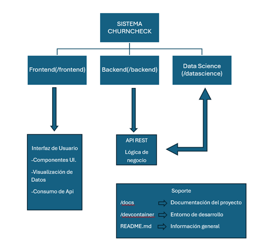

La comunicación entre los distintos componentes se realiza mediante servicios **REST** y el formato **JSON**, garantizando interoperabilidad entre tecnologías heterogéneas y facilitando la escalabilidad del sistema.

El diseño arquitectónico permite:

- Independencia entre frontend, backend y modelo predictivo.  
- Facilidad de mantenimiento y evolución de cada módulo.  
- Integración flexible con servicios externos.  
- Resiliencia ante fallos parciales del sistema.  

## 5. Módulo de Data Science

[⬆️ Volver arriba](#especificación-técnica-1)

### 5.1 Rol del Data Science en ChurnCheck

El módulo de Data Science constituye el núcleo analítico del sistema. Su responsabilidad principal es identificar patrones de comportamiento en los clientes y calcular la probabilidad de abandono de forma anticipada. Este componente representa el punto de partida del flujo funcional del sistema y es fundamental para la generación de información estratégica.

[⬆️ Volver a 5. Módulo de Data Science](#5-módulo-de-data-science)

### 5.2 Dataset y Comprensión de los Datos

Para el desarrollo del modelo predictivo se utilizó el dataset `gym_churn_us.csv`, el cual contiene información relevante asociada al comportamiento de los clientes, incluyendo:

- Datos demográficos.  
- Antigüedad y duración del contrato.  
- Frecuencia de asistencia.  
- Consumo de servicios adicionales.  

La correcta comprensión del dataset permitió identificar variables clave para la predicción del abandono de clientes.

[⬆️ Volver a 5. Módulo de Data Science](#5-módulo-de-data-science)

### 5.3 Limpieza y Preparación de Datos

El proceso de limpieza y preparación de datos incluyó las siguientes actividades:

- Eliminación de registros duplicados.  
- Tratamiento de valores nulos mediante técnicas de imputación.  
- Detección y manejo de valores atípicos (*outliers*).  
- Normalización y estandarización de variables numéricas.  

Estas acciones garantizaron la calidad, consistencia y confiabilidad de los datos utilizados en el entrenamiento del modelo.

[⬆️ Volver a 5. Módulo de Data Science](#5-módulo-de-data-science)

### 5.4 Análisis Exploratorio de Datos (EDA)

El Análisis Exploratorio de Datos permitió identificar patrones y comportamientos relevantes en los datos analizados, entre los cuales destacan:

- El mayor riesgo de abandono ocurre durante los primeros 3 a 5 meses de afiliación.  
- La frecuencia de asistencia reciente es uno de los predictores más influyentes.  
- Variables como el género no presentan una influencia significativa en la probabilidad de abandono.  

**Figura 5.1. Resultados del Análisis Exploratorio de Datos**
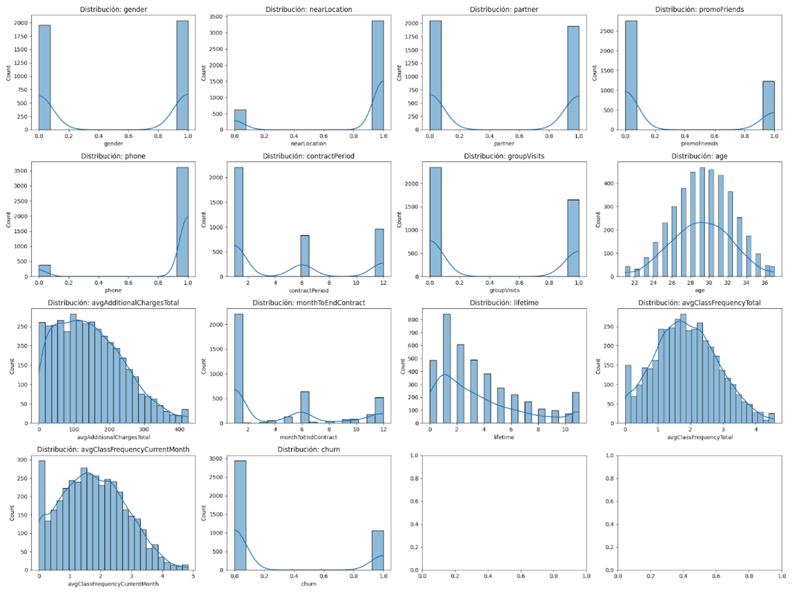

[⬆️ Volver a 5. Módulo de Data Science](#5-módulo-de-data-science)

### 5.5 Selección y Entrenamiento del Modelo

Se evaluaron distintos algoritmos de *machine learning*, incluyendo modelos base y modelos avanzados. Tras un proceso de comparación y ajuste de hiperparámetros, se seleccionó una **Regresión Logística optimizada**, debido a su equilibrio entre desempeño predictivo, interpretabilidad y eficiencia computacional.

Las métricas obtenidas durante la evaluación del modelo fueron las siguientes:

- **Accuracy:** 92.8%  
- **Recall:** 84.5%  
- **F1-Score:** 85.2%  

Estos resultados evidencian una adecuada capacidad del modelo para identificar clientes con alto riesgo de abandono.

**Figura 5.2. Comparativo Regresión Logística vs. Random Forest**
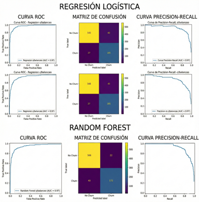

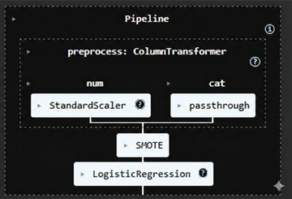

[⬆️ Volver a 5. Módulo de Data Science](#5-módulo-de-data-science)

### 5.6 Despliegue del Modelo como Servicio

El modelo predictivo fue desplegado como un microservicio utilizando **FastAPI**, permitiendo su consumo en tiempo real por otros componentes del sistema a través de una **API REST**. Este enfoque facilita el desacoplamiento del modelo respecto al resto de la arquitectura y permite su evolución independiente.

El endpoint expuesto recibe los datos del cliente, procesa la información mediante el modelo entrenado y retorna la probabilidad estimada de abandono.

[⬆️ Volver a 5. Módulo de Data Science](#5-módulo-de-data-science)

## 6. Backend del Sistema

[⬆️ Volver arriba](#especificación-técnica-1)

### 6.1 Rol del Backend

El backend actúa como el motor lógico del sistema, siendo responsable de centralizar la lógica de negocio y orquestar la comunicación entre el frontend y el módulo de Data Science. Este componente garantiza la correcta gestión de los datos, la aplicación de reglas de negocio y la integración eficiente entre los distintos módulos del sistema.

[⬆️ Volver a 6. Backend del sistema](#6-backend-del-sistema)

### 6.2 Stack Tecnológico

El backend de ChurnCheck fue desarrollado utilizando un stack tecnológico moderno y robusto, compuesto por las siguientes herramientas y tecnologías:

- **Java 21**  
- **Spring Boot 3**  
- **Spring Security**  
- **JWT (JSON Web Tokens)** para autenticación  
- **H2 Database** como base de datos en memoria  
- **Hibernate / Spring Data JPA**  
- **Maven** como herramienta de gestión de dependencias  

Este conjunto tecnológico permite construir servicios escalables, seguros y fáciles de mantener.

[⬆️ Volver a 6. Backend del sistema](#6-backend-del-sistema)

### 6.3 Arquitectura por Capas

El backend implementa una arquitectura por capas, la cual favorece la separación de responsabilidades y mejora la mantenibilidad del sistema. Las capas que componen esta arquitectura son:

- **Controladores:** Exponen los endpoints REST y gestionan las solicitudes HTTP.  
- **Servicios:** Contienen la lógica de negocio del sistema.  
- **Dominio:** Define las entidades y modelos del negocio.  
- **Infraestructura:** Maneja la persistencia de datos y la integración con servicios externos.  
- **Configuración:** Centraliza la configuración de seguridad y del framework.  

**Figura 6.1. Arquitectura por capas del backend**
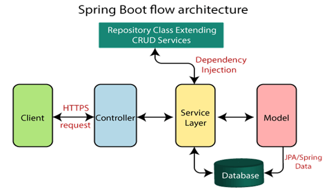

### 6.4 Persistencia y Gestión de Datos

Para la persistencia de datos se utilizó una base de datos en memoria **H2**, lo que permitió una rápida configuración y una alta portabilidad durante la demostración del sistema. Este enfoque resulta adecuado para entornos de prueba y hackathons, ya que elimina dependencias externas complejas.

[⬆️ Volver a 6. Backend del sistema](#6-backend-del-sistema)

### 6.5 Integración Backend – Data Science

El backend se comunica con el módulo de Data Science mediante servicios REST, consumiendo el modelo predictivo como un servicio externo. Esta integración permite mantener el desacoplamiento entre componentes y mejorar la resiliencia del sistema.

[⬆️ Volver a 6. Backend del sistema](#6-backend-del-sistema)

## 7. Frontend del Sistema

[⬆️ Volver arriba](#especificación-técnica-1)

### 7.1 Rol del Frontend

El frontend constituye la capa de presentación del sistema y representa el punto de contacto directo con el usuario final. Su principal objetivo es traducir resultados analíticos complejos en información visual clara, comprensible y accionable, facilitando la toma de decisiones estratégicas.

[⬆️ Volver a 7. Frontend del sistema](#7-frontend-del-sistema)

### 7.2 Tecnologías Utilizadas

El desarrollo del frontend se realizó utilizando las siguientes tecnologías:

- **HTML** para la estructura de la interfaz.  
- **CSS** para el diseño visual y la presentación.  
- **JavaScript** para la lógica y la interacción.  
- **Chart.js** para la visualización de datos mediante gráficos interactivos.  
- **Vite** como herramienta de construcción y desarrollo rápido.  

[⬆️ Volver a 7. Frontend del sistema](#7-frontend-del-sistema)

### 7.3 Arquitectura del Frontend

El frontend sigue una arquitectura simple y clara basada en la separación de responsabilidades entre estructura, estilos y lógica de negocio. Este enfoque mejora la mantenibilidad del código y facilita la incorporación de nuevas funcionalidades.

**Figura 7.1. Estructura del proyecto frontend**
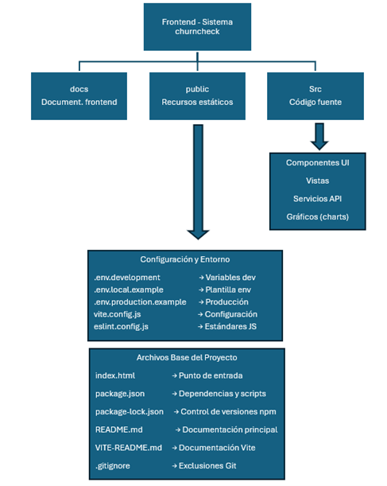

[⬆️ Volver a 7. Frontend del sistema](#7-frontend-del-sistema)

### 7.4 Dashboard Analítico

El dashboard analítico constituye el componente central del frontend y permite al usuario:

- Visualizar la probabilidad de *churn* por cliente.  
- Clasificar clientes según su nivel de riesgo.  
- Identificar clientes prioritarios mediante indicadores visuales.  
- Analizar tendencias a través de gráficos interactivos.  

La información se presenta de forma intuitiva, reduciendo la complejidad inherente a los resultados analíticos.

[⬆️ Volver a 7. Frontend del sistema](#7-frontend-del-sistema)

## 8. Flujo Completo del Sistema

[⬆️ Volver arriba](#especificación-técnica-1)

El flujo completo del sistema **ChurnCheck** abarca desde la interacción inicial del usuario hasta la visualización de los resultados predictivos generados por el modelo de *machine learning*. Este flujo integra de forma coordinada los tres pilares del sistema: **Frontend**, **Backend** y **Data Science**.

El proceso general se desarrolla de la siguiente manera:

1. El usuario interactúa con el **frontend web**, solicitando información sobre el riesgo de abandono de uno o varios clientes.  
2. El frontend envía la solicitud al **backend** a través de la API REST.  
3. El backend procesa la solicitud y, cuando es necesario, consume el **microservicio de Data Science** para obtener la probabilidad de *churn*.  
4. El modelo predictivo calcula la probabilidad de abandono y devuelve el resultado al backend.  
5. El backend retorna la información procesada al frontend.  
6. El frontend presenta los resultados al usuario mediante gráficos e indicadores visuales.

**Figura 8.1. Flujo completo del sistema**
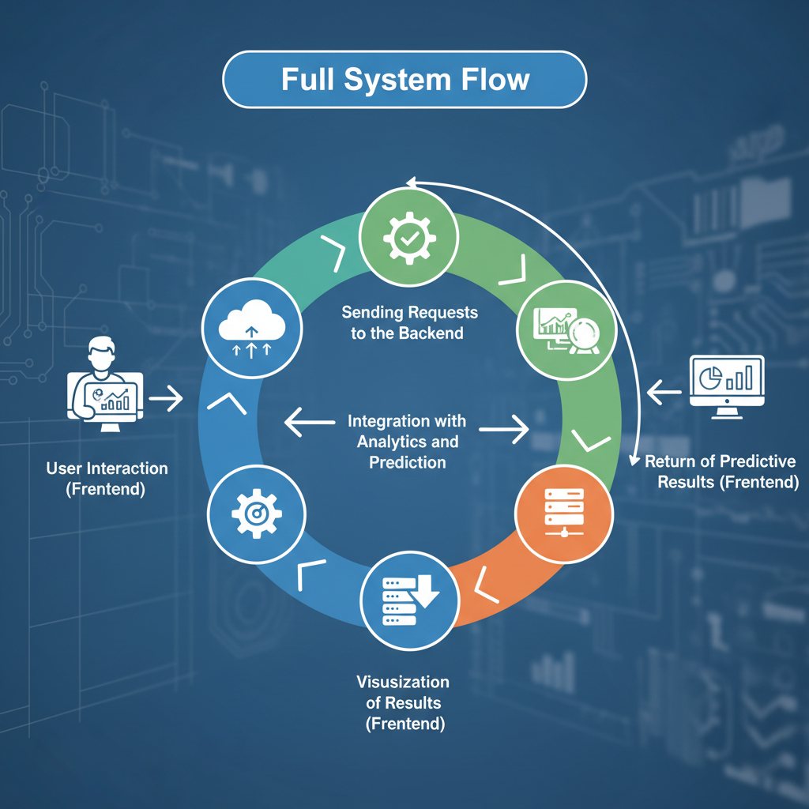

Este flujo desacoplado permite una comunicación eficiente entre componentes, mejora la escalabilidad del sistema y facilita su mantenimiento a largo plazo.

## 9. Evaluación del Sistema

[⬆️ Volver arriba](#especificación-técnica-1)

El sistema **ChurnCheck** fue evaluado considerando distintos criterios técnicos y funcionales, con el objetivo de validar su correcto funcionamiento durante la demostración del proyecto.

Los principales aspectos evaluados fueron:

- Correcta integración entre los módulos de **Data Science**, **Backend** y **Frontend**.  
- Tiempo de respuesta del sistema ante solicitudes de predicción.  
- Claridad y comprensibilidad de la información visual presentada en el dashboard.  
- Estabilidad general del sistema durante su ejecución en un entorno de demostración.  

Los resultados de la evaluación evidencian que el sistema cumple con los objetivos planteados, ofreciendo una solución funcional, estable y alineada con las buenas prácticas de desarrollo de software.

---

## 10. Conclusiones

[⬆️ Volver arriba](#especificación-técnica-1)

ChurnCheck demuestra que una solución basada en analítica predictiva, respaldada por una arquitectura backend robusta y presentada mediante un frontend intuitivo, puede transformar datos en decisiones estratégicas de alto impacto.

La integración efectiva de técnicas de **Data Science** con una arquitectura desacoplada permite anticipar el abandono de clientes y brinda a las organizaciones una herramienta valiosa para la ejecución de acciones preventivas de retención. A pesar de haber sido desarrollado en el contexto de un hackathon, el proyecto presenta una base técnica sólida, escalable y alineada con estándares profesionales.

## 11. Trabajo Futuro

[⬆️ Volver arriba](#especificación-técnica-1)

Las siguientes líneas de trabajo permitirían evolucionar la plataforma **ChurnCheck** hacia un entorno productivo real:

- Implementación de persistencia histórica de predicciones de *churn*.  
- Autenticación y autorización basada en roles para distintos perfiles de usuario.  
- Generación de alertas automáticas ante clientes con alto riesgo de abandono.  
- Optimización de la experiencia de usuario (UX) y mejoras en la interfaz gráfica.  
- Integración con sistemas empresariales reales y fuentes de datos externas.  

---

## 12. Anexos

[⬆️ Volver arriba](#especificación-técnica-1)

Los anexos complementan el cuerpo principal del informe, proporcionando información técnica adicional que respalda el diseño y la implementación del sistema.

### Anexo A. Diccionario de Datos

| Variable | Tipo | Descripción |
| :--- | :--- | :--- |
| **idClient** | Integer | Identificador único del cliente. |
| **gender** | Binary | Género del cliente (0 o 1). |
| **nearLocation** | Binary | Indica si el cliente vive o trabaja cerca del centro (1: Sí, 0: No). |
| **partner** | Binary | Indica si el cliente es empleado de una empresa asociada (1: Sí, 0: No). |
| **promoFriends** | Binary | Indica si el cliente se unió mediante la promoción "Trae a un amigo" (1: Sí, 0: No). |
| **phone** | Binary | Indica si el cliente proporcionó su número de teléfono (1: Sí, 0: No). |
| **contractPeriod** | Integer | Duración del contrato actual en meses ({1, 6, 12}). |
| **groupVisits** | Binary | Indica si el cliente participa en sesiones grupales (1: Sí, 0: No). |
| **age** | Integer | Edad del cliente. Valores admitidos: Min. 18 - Max. 41 |
| **avgAdditionalChargesTotal** | Float | Promedio de gastos adicionales en el centro (cafetería, masajes, etc.) Valores admitidos: 0.15 a 552.33 |
| **monthToEndContract** | Integer | Meses restantes hasta la finalización del contrato. 1 a 12 |
| **lifetime** | Integer | Tiempo (en meses) desde que el cliente se unió por primera vez. 0 a 31 |
| **avgClassFrequencyTotal** | Float | Frecuencia media de visitas por semana desde el inicio. Valores admitidos: 0.00 a 6.02 |
| **avgClassFrequencyCurrentMonth** | Float | Frecuencia media de visitas por semana en el último mes. Valores admitidos: 0.00 a 6.15 |

### Anexo B. Métricas del Modelo Predictivo

Las métricas utilizadas para evaluar el desempeño del modelo predictivo fueron:

- **Accuracy:** 92.8%  
- **Recall:** 84.5%  
- **F1-Score:** 85.2%  

Estas métricas confirman la capacidad del modelo para identificar clientes con alto riesgo de abandono.

### Anexo C. Endpoints del Backend

| Método | Endpoint | Descripción |
|------|----------|-------------|
| POST | /auth/login | Autentica un usuario por email y password y retorna un token de autenticación JWT. |
| GET | /clients/prediction/{dni} | Obtiene la predicción de churn de un cliente por su DNI. [Sólo usuarios autenticados]|
| GET | /clients/clients/statistics/{id} | Obtiene las estadísticas de un cliente (asistencia al gimnasio en los últimos seis meses y gastos adicionales por categoría) por su ID. [Sólo usuarios autenticados]|
| GET | /api/stats | Obtiene las estadísticas globales de la base de datos del negocio: Total de clientes, clientes activos y promedio de edad. [Sólo usuarios autenticados]|

### Anexo D. Glosario Técnico

**API (Application Programming Interface).**  
Interfaz que permite la comunicación entre diferentes sistemas de software, facilitando el intercambio de datos y funcionalidades mediante protocolos definidos.

**Backend.**  
Capa del sistema responsable de la lógica de negocio, la gestión de datos y la comunicación con servicios externos.

**Churn.**  
Indicador que representa la pérdida de clientes o usuarios de un servicio durante un periodo determinado.

**Churn Prediction.**  
Proceso analítico orientado a estimar la probabilidad de abandono de un cliente utilizando datos históricos y modelos predictivos.

**CSS (Cascading Style Sheets).**  
Lenguaje utilizado para definir el diseño visual y la presentación de una aplicación web.

**Dashboard.**  
Interfaz gráfica que presenta indicadores clave y métricas relevantes del sistema de forma visual y resumida.

**Deploy.**  
Proceso de publicación de una aplicación en un entorno accesible para los usuarios finales.

**EDA (Exploratory Data Analysis).**  
Análisis exploratorio de datos cuyo objetivo es identificar patrones, tendencias y anomalías relevantes.

**Frontend.**  
Capa del sistema responsable de la interacción directa con el usuario y la visualización de la información.

**JSON (JavaScript Object Notation).**  
Formato ligero de intercambio de datos basado en texto, ampliamente utilizado en servicios web.

**Machine Learning.**  
Conjunto de técnicas que permiten a los sistemas aprender patrones a partir de datos y realizar predicciones.

**Microservicio.**  
Arquitectura que divide una aplicación en servicios pequeños, independientes y desacoplados.

**REST.**  
Estilo arquitectónico para el diseño de servicios web basado en operaciones estándar HTTP.

**UX (User Experience).**  
Experiencia global del usuario al interactuar con el sistema, incluyendo usabilidad y accesibilidad.

**Vite.**  
Herramienta de desarrollo frontend que optimiza el rendimiento y la velocidad de construcción de aplicaciones web.

### Anexo E. Snapshots
**Dashboard general del sistema**

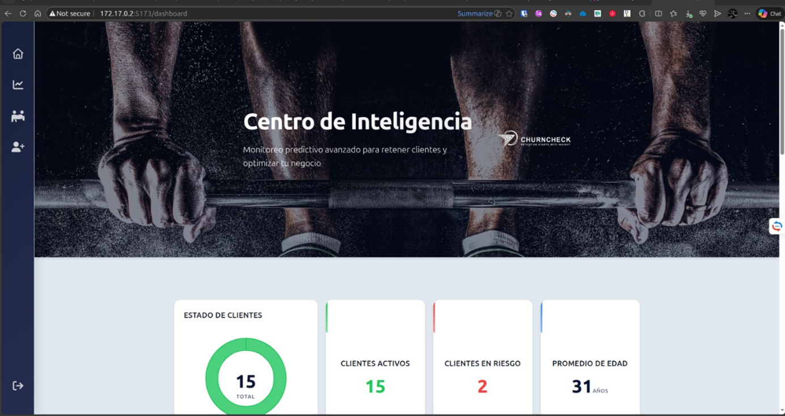

**Indicadores y alertas de abandono**

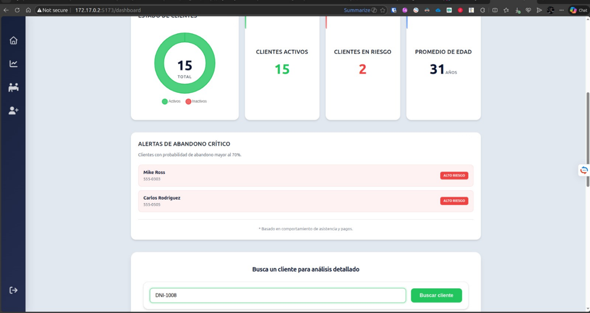

**Análisis de asistencia por cliente**

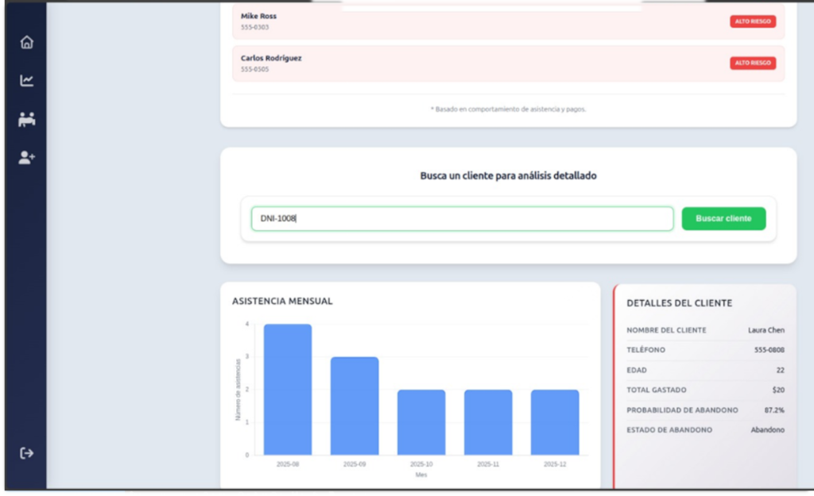

**Análisis de gastos adicionales del cliente y recomendaciones del sistema**

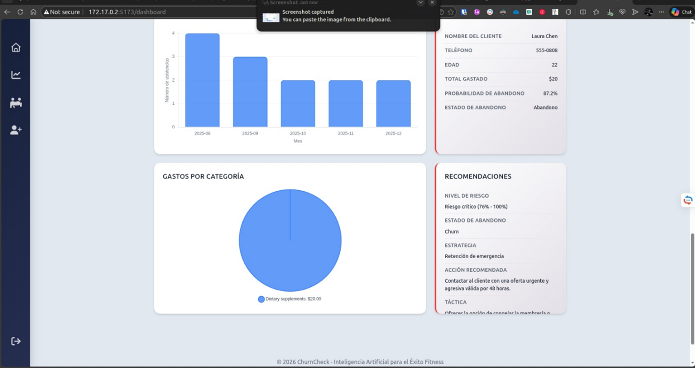
