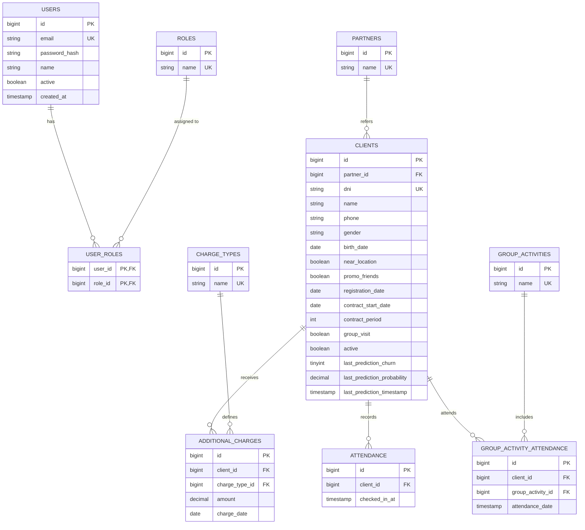

## Hackathon Oracle Next Education II - Latam

***Desafío intensivo de innovación para participantes de todo Latam.***

powered by 

----

# ChurnCheck - Arquitectura y Diseño de Datos (ERD)
## Predicción de Cancelación de Clientes

* Proyecto ChurnInsight
* **Equipo: H12-25-L-Equipo 14-Data Science**

-----

> Aunque el modelo de predicción trabaja con un dataset estructurado de forma estática, se ha decidido implementar un Modelo de Datos Dinámico. El objetivo es aportar realismo técnico a la simulación, transformando una base de datos plana en un sistema transaccional capaz de generar dinámicamente la información que el modelo de IA requiere.

-----

**Entidades principales:**
- **USERS**: Gestiona usuarios del sistema con autenticación
- **ROLES**: Define roles disponibles
- **PARTNERS**: Empresas o socios asociados
- **CLIENTS**: Clientes registrados en el sistema
- **CHARGE_TYPES**: Tipos de cargos adicionales
- **ADDITIONAL_CHARGES**: Cargos adicionales aplicados a clientes
- **ATTENDANCE**: Registro de asistencia individual
- **GROUP_ACTIVITIES**: Actividades grupales
- **GROUP_ACTIVITY_ATTENDANCE**: Asistencia a actividades grupales

**Relaciones clave:**
- Los usuarios tienen roles mediante una tabla de unión
- Los clientes están asociados a partners
- Los clientes generan cargos adicionales
- Los clientes registran asistencia individual y grupal

PK = Primary Key, FK = Foreign Key, UK = Unique Key

-----

-----

### Mapeo de Variables para el Modelo de IA

La siguiente tabla detalla las variables procesadas que el modelo de Machine Learning utiliza para calcular la probabilidad de abandono. Estos datos se derivan dinámicamente de las entidades relacionales definidas anteriormente.

| Variable | Tipo | Descripción |
| :--- | :--- | :--- |
| **idClient** | Integer | Identificador único del cliente. |
| **gender** | Binary | Género del cliente (0 o 1). |
| **nearLocation** | Binary | Indica si el cliente vive o trabaja cerca del centro (1: Sí, 0: No). |
| **partner** | Binary | Indica si el cliente es empleado de una empresa asociada (1: Sí, 0: No). |
| **promoFriends** | Binary | Indica si el cliente se unió mediante la promoción "Trae a un amigo" (1: Sí, 0: No). |
| **phone** | Binary | Indica si el cliente proporcionó su número de teléfono (1: Sí, 0: No). |
| **contractPeriod** | Integer | Duración del contrato actual en meses ({1, 6, 12}). |
| **groupVisits** | Binary | Indica si el cliente participa en sesiones grupales (1: Sí, 0: No). |
| **age** | Integer | Edad del cliente. Min: 18 - Max: 41 |
| **avgAdditionalChargesTotal** | Float | Promedio de gastos adicionales en el centro (cafetería, masajes, etc.) **0.15 a 552.33** |
| **monthToEndContract** | Integer | Meses restantes hasta la finalización del contrato. 1 a 12 |
| **lifetime** | Integer | Tiempo (en meses) desde que el cliente se unió por primera vez. 0 a 31 |
| **avgClassFrequencyTotal** | Float | Frecuencia media de visitas por semana desde el inicio. **0.00 a 6.02** |
| **avgClassFrequencyCurrentMonth** | Float | Frecuencia media de visitas por semana en el último mes.**0.00 a 6.15** |

-----

[Volver al README del proyecto](../README.md)

