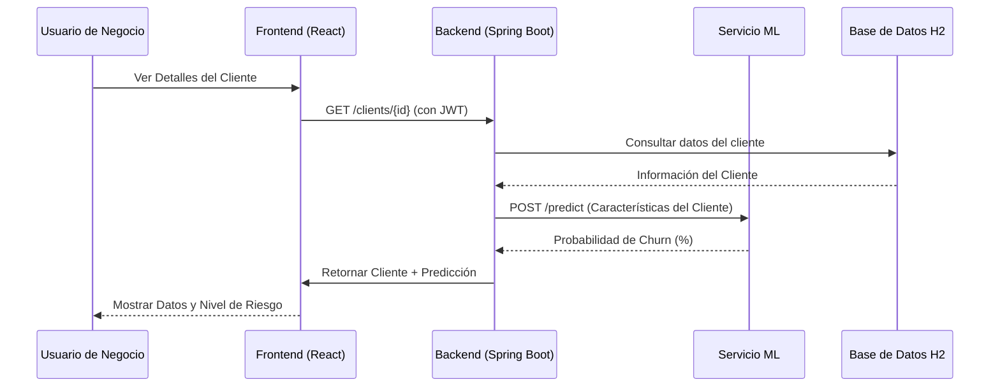

# Proyecto ChurnCheck

## Descripción General

**ChurnCheck** es un ecosistema integral diseñado para predecir y prevenir la fuga de clientes (churn). Combina un potente backend en Spring Boot, un frontend moderno en React y un pipeline de Data Science dedicado para proporcionar información accionable destinada a la retención de clientes.

---

## Arquitectura

El sistema sigue una arquitectura desacoplada donde el Frontend se comunica con el Backend a través de una API REST, y el Backend gestiona la lógica de negocio, la seguridad y la integración con los modelos de Data Science.

### Diagrama del Sistema

```mermaid
graph TD
    subgraph "Frontend: Lado del Cliente (React + Vite)"
        direction TB
        F_Views[Páginas: Home, Login, Dashboard, Perfil]
        F_Comp[Componentes: Nav, Sidebar, Charts, ClientList]
        F_Axios[Servicios: Axios + Interceptores de Auth]
        F_Store[Estado: AuthContext / JWT]
        
        F_Views --> F_Comp
        F_Comp --> F_Axios
        F_Axios --> F_Store
    end

    subgraph "Backend: Lado del Servidor (Spring Boot)"
        direction TB
        B_Sec[Seguridad: Filtro JWT / CorsConfig]
        B_Cont[Controladores: Auth, Client, Statistics]
        B_Serv[Servicios: Orquestador de Predicción / ClientService]
        B_DTO[Datos: DTOs de Solicitud/Respuesta]
        B_Repo[Persistencia: Repositorios JPA / Hibernate]
        
        B_Sec --> B_Cont
        B_Cont --> B_Serv
        B_Serv --> B_DTO
        B_Serv --> B_Repo
    end

    subgraph "Base de Datos (PostgreSQL)"
        direction LR
        D_Client["Entidad: Client (DNI, Teléfono, etc)"]
        D_Attr["Entidad: Attendance"]
        D_Charge["Entidad: AdditionalCharge"]
        D_Partner["Entidad: Partner"]
        
        D_Client --- D_Attr
        D_Client --- D_Charge
        D_Client --- D_Partner
    end

    subgraph "Data Science / Servicio ML"
        direction TB
        ML_API[API de Predicción FastAPI]
        ML_Models[Modelos: LightGBM / Joblib]
        ML_API --> ML_Models
    end

    %% Conexiones
    F_Axios -- "HTTP/JSON + JWT" --> B_Sec
    B_Repo -- "SQL / JDBC" --> D_Client
    B_Serv -- "Solicitud REST" --> ML_API
```

---

## Desglose de Componentes

### 1. Backend (Java / Spring Boot)

El núcleo de la aplicación, responsable de la seguridad, gestión de datos y orquestación.

- **Seguridad**: Spring Security con autenticación basada en JWT (JSON Web Token).
- **Base de Datos**: PostgreSQL con JPA/Hibernate.
- **Controladores**:
  - `AuthController`: Gestiona el registro y el inicio de sesión.
  - `ClientController`: Operaciones CRUD para la gestión de clientes y seguimiento de estados.
  - `StatisticsController`: Proporciona datos agregados para los paneles de control.
- **Integración**: Se comunica con el servicio de ML para proporcionar predicciones de churn en tiempo real.

### 2. Frontend (React / Vite)

Una interfaz de usuario responsiva y dinámica para que los usuarios empresariales gestionen clientes y visualicen riesgos.

- **Stack**: Vite, React, Axios, Vanilla CSS / Tailwind (para estilos).
- **Características**:
  - Inicio/Cierre de sesión seguro con almacenamiento de JWT.
  - Panel de control del cliente con visualizaciones predictivas.
  - Gráficos interactivos y filtrado de clientes.
- **Interceptores**: Inyección automática de cabeceras de autorización mediante interceptores de Axios.

### 3. Data Science (Python / ML)

El motor analítico que identifica patrones en el comportamiento de los clientes.

- **Flujo de Trabajo**:
  - **Ingesta**: Datos brutos almacenados en `data/raw/`.
  - **Procesamiento**: Limpieza estandarizada e ingeniería de características en `notebooks/preprocessing/`.
  - **Modelado**: Entrenamiento y evaluación de modelos LightGBM/XGBoost.
- **Artefactos**: Los modelos finales se exportan como archivos `.joblib` y se documentan en `reports/`.
- **Integración**: Define esquemas JSON para la compatibilidad con el Backend.

---

## Flujo de Trabajo Clave: Predicción de Churn

El siguiente diagrama ilustra cómo se procesa una solicitud de predicción de churn a través del sistema:

---

## Stack Tecnológico

| Capa | Tecnologías |
| :--- | :--- |
| **Frontend** | React, Vite, Axios, Lucide-React, JavaScript |
| **Backend** | Java 21, Spring Boot 4.0, Spring Security, JWT, Maven |
| **Base de Datos** | H2, Hibernate, JPA |
| **ML/DS** | Python, Pandas, Scikit-Learn, LightGBM, Joblib |
| **DevOps** | Docker (DevContainers), Git |
